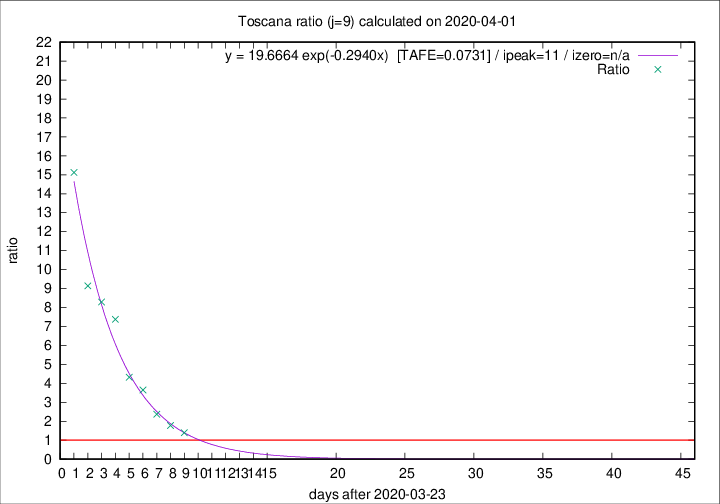
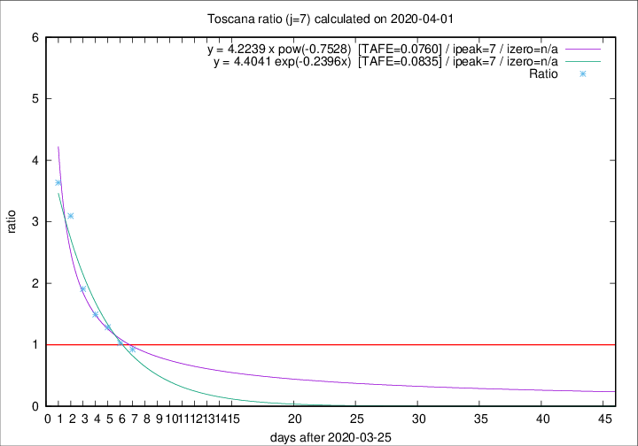

# Toscana

Data source: https://raw.githubusercontent.com/pcm-dpc/COVID-19/master/dati-json/dpc-covid19-ita-regioni.json

Estimates in this page were made on 10/4/2020 with data available until 01/04/2020.

## Summary 

### Peak estimate 
|j|linear [TAFE]|exponential [TAFE]|power law [TAFE]|details|
|---|----|-----------|---------|-------|
|7|1/4/2020 [TAFE=0.1850]|2/4/2020 [TAFE=0.0835]|2/4/2020 [TAFE=0.0760]|[analysis](COVID-19_toscana_j7_2020-04-01.md)|
|8|2/4/2020 [TAFE=0.2940]|2/4/2020 [TAFE=0.0825]|5/4/2020 [TAFE=0.1605]|[analysis](COVID-19_toscana_j8_2020-04-01.md)|
|9|2/4/2020 [TAFE=0.2962]|4/4/2020 [TAFE=0.0731]|11/4/2020 [TAFE=0.2339]|[analysis](COVID-19_toscana_j9_2020-04-01.md)|
|10|2/4/2020 [TAFE=0.2633]|5/4/2020 [TAFE=0.1146]|22/4/2020 [TAFE=0.3215]|[analysis](COVID-19_toscana_j10_2020-04-01.md)|
|11|1/4/2020 [TAFE=0.8456]|6/4/2020 [TAFE=0.2096]|29/4/2020 [TAFE=0.3039]|[analysis](COVID-19_toscana_j11_2020-04-01.md)|
|12|1/4/2020 [TAFE=0.7851]|8/4/2020 [TAFE=0.2146]|25/5/2020 [TAFE=0.3796]|[analysis](COVID-19_toscana_j12_2020-04-01.md)|
|13|-|-|-||
|14|-|-|-||

Best estimator is exp with j=9 (TAFE=0.0731)
Corresponding peak date estimate is 4/4/2020 (ipeak 11)

Peak date range estimate: 24/3/2020 - 28/5/2020

### End estimate 
|j|linear [TAFE/TFE]|exponential [TAFE/TFE]|power law [TAFE/TFE]|details|
|---|----|-----------|---------|-------|
|7|4/4/2020 [TAFE=0.1850]|-|-|[analysis](COVID-19_toscana_j7_2020-04-01.md)|
|8|-|-|-|[analysis](COVID-19_toscana_j8_2020-04-01.md)|
|9|-|-|-|[analysis](COVID-19_toscana_j9_2020-04-01.md)|
|10|-|-|-|[analysis](COVID-19_toscana_j10_2020-04-01.md)|
|11|-|-|-|[analysis](COVID-19_toscana_j11_2020-04-01.md)|
|12|-|-|-|[analysis](COVID-19_toscana_j12_2020-04-01.md)|
|13|-|-|-||
|14|-|-|-||

Best estimator is linear with j=7 (TAFE=0.1850)
Corresponding end date estimate is 4/4/2020 (izero 9)

End date range estimate: 26/3/2020 - 6/4/2020

Generated April 10th, 2020 at 17:26:10 UTC+0200 with https://github.com/robianc/COVID-19
