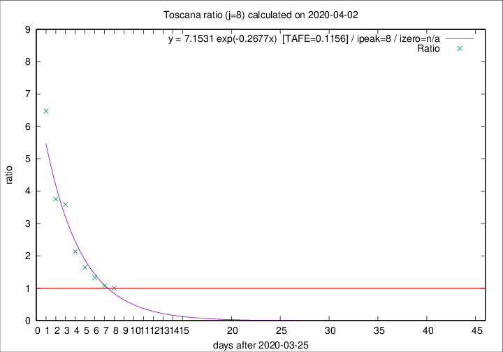

# Toscana

Data source: https://raw.githubusercontent.com/pcm-dpc/COVID-19/master/dati-json/dpc-covid19-ita-regioni.json

Delta days analysis (j): 8

## Fitting 
|fit type|best fit equation|tafe|tfe|ipeak|izero|
|-------|-----|--------|------|---|---|
|exp|y = 7.1531 exp(-0.2677x)  [TAFE=0.1156]|0.1156|0.0081|8|n/a|

## Data
|Date|Daily deaths|Cumulated deaths|Deaths in the last 8 days|Deaths in the 8 days before|ratio|
|----|----------|-----------|-------|--------------------|-----|
|2020-04-02|15|268|126|125|1.0080|
|2020-04-01|9|253|124|115|1.0783|
|2020-03-31|13|244|135|101|1.3366|
|2020-03-30|16|231|140|85|1.6471|
|2020-03-29|17|215|143|67|2.1343|
|2020-03-28|21|198|151|42|3.5952|
|2020-03-27|19|177|139|37|3.7568|
|2020-03-26|16|158|136|21|6.4762|

[Download data as CSV](COVID-19_toscana_j8_2020-04-02.csv)

Generated April 8th, 2020 at 23:43:36 UTC+0200 with https://github.com/robianc/COVID-19
