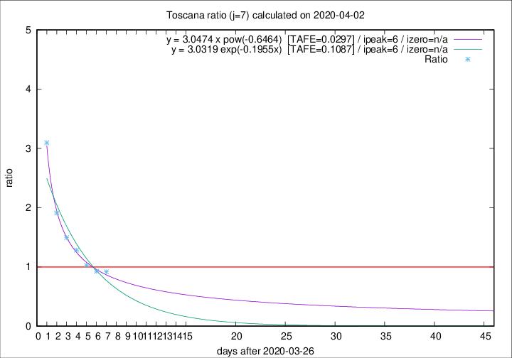

# Toscana

Data source: https://raw.githubusercontent.com/pcm-dpc/COVID-19/master/dati-json/dpc-covid19-ita-regioni.json

Estimates in this page were made on 19/4/2020 with data available until 02/04/2020.

## Summary 

### Peak estimate 
|j|linear [TAFE]|exponential [TAFE]|power law [TAFE]|details|
|---|----|-----------|---------|-------|
|7|2/4/2020 [TAFE=0.1935]|2/4/2020 [TAFE=0.1087]|2/4/2020 [TAFE=0.0297]|[analysis](COVID-19_toscana_j7_2020-04-02.md)|
|8|2/4/2020 [TAFE=0.2976]|3/4/2020 [TAFE=0.1156]|4/4/2020 [TAFE=0.0863]|[analysis](COVID-19_toscana_j8_2020-04-02.md)|
|9|3/4/2020 [TAFE=0.2809]|4/4/2020 [TAFE=0.0826]|8/4/2020 [TAFE=0.2471]|[analysis](COVID-19_toscana_j9_2020-04-02.md)|
|10|2/4/2020 [TAFE=0.3984]|5/4/2020 [TAFE=0.0811]|14/4/2020 [TAFE=0.2849]|[analysis](COVID-19_toscana_j10_2020-04-02.md)|
|11|3/4/2020 [TAFE=0.2466]|7/4/2020 [TAFE=0.1698]|4/5/2020 [TAFE=0.4306]|[analysis](COVID-19_toscana_j11_2020-04-02.md)|
|12|2/4/2020 [TAFE=1.1400]|7/4/2020 [TAFE=0.1920]|1/5/2020 [TAFE=0.3739]|[analysis](COVID-19_toscana_j12_2020-04-02.md)|
|13|-|-|-||
|14|-|-|-||

Best estimator is pow with j=7 (TAFE=0.0297)
Corresponding peak date estimate is 2/4/2020 (ipeak 6)

Peak date range estimate: 27/3/2020 - 8/5/2020

### End estimate 
|j|linear [TAFE/TFE]|exponential [TAFE/TFE]|power law [TAFE/TFE]|details|
|---|----|-----------|---------|-------|
|7|5/4/2020 [TAFE=0.1935]|-|-|[analysis](COVID-19_toscana_j7_2020-04-02.md)|
|8|-|-|-|[analysis](COVID-19_toscana_j8_2020-04-02.md)|
|9|-|-|-|[analysis](COVID-19_toscana_j9_2020-04-02.md)|
|10|-|-|-|[analysis](COVID-19_toscana_j10_2020-04-02.md)|
|11|-|-|-|[analysis](COVID-19_toscana_j11_2020-04-02.md)|
|12|-|-|-|[analysis](COVID-19_toscana_j12_2020-04-02.md)|
|13|-|-|-||
|14|-|-|-||

Best estimator is linear with j=7 (TAFE=0.1935)
Corresponding end date estimate is 5/4/2020 (izero 9)

End date range estimate: 27/3/2020 - 7/4/2020

Generated April 19th, 2020 at 18:42:39 UTC+0200 with https://github.com/robianc/COVID-19
