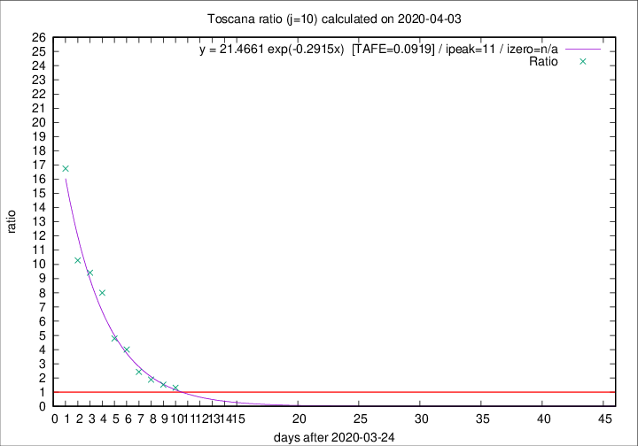

# Toscana

Data source: https://raw.githubusercontent.com/pcm-dpc/COVID-19/master/dati-json/dpc-covid19-ita-regioni.json

Delta days analysis (j): 10

Analyses for other values of j for 2020-04-03 are avalable [here](../2020-04-03/README.md)

Analyses for Toscana for previous dates are avalable [here](../README.md)

## Fitting 
|fit type|best fit equation|tafe|tfe|ipeak|izero|
|-------|-----|--------|------|---|---|
|exp|y = 21.4661 exp(-0.2915x)  [TAFE=0.0919]|0.0919|0.0054|11|n/a|

## Data
|Date|Daily deaths|Cumulated deaths|Deaths in the last 10 days|Deaths in the 10 days before|ratio|
|----|----------|-----------|-------|--------------------|-----|
|2020-04-03|22|290|161|123|1.3089|
|2020-04-02|15|268|159|104|1.5288|
|2020-04-01|9|253|162|86|1.8837|
|2020-03-31|13|244|172|71|2.4225|
|2020-03-30|16|231|184|46|4.0000|
|2020-03-29|17|215|177|37|4.7838|
|2020-03-28|21|198|176|22|8.0000|
|2020-03-27|19|177|160|17|9.4118|
|2020-03-26|16|158|144|14|10.2857|
|2020-03-25|13|142|134|8|16.7500|

[Download data as CSV](COVID-19_toscana_j10_2020-04-03.csv)

Generated April 14th, 2020 at 19:16:04 UTC+0200 with https://github.com/robianc/COVID-19
