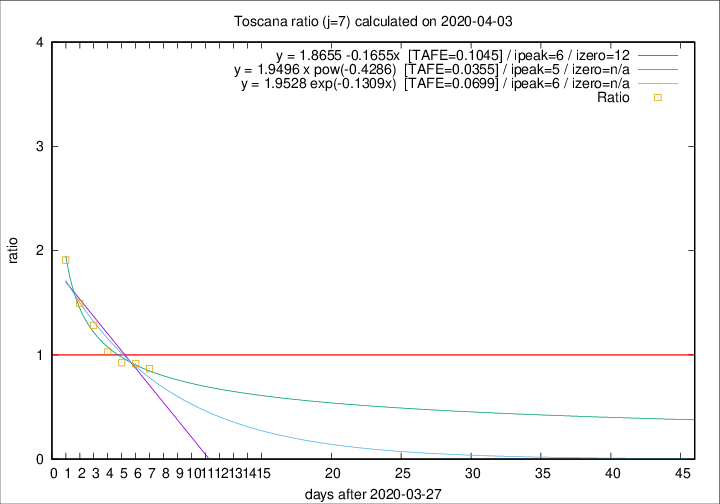

# Toscana

Data source: https://raw.githubusercontent.com/pcm-dpc/COVID-19/master/dati-json/dpc-covid19-ita-regioni.json

Delta days analysis (j): 7

## Fitting 
|fit type|best fit equation|tafe|tfe|ipeak|izero|
|-------|-----|--------|------|---|---|
|linear|y = 1.8655 -0.1655x  [TAFE=0.1045]|0.1045|0.0062|6|12|
|exp|y = 1.9528 exp(-0.1309x)  [TAFE=0.0699]|0.0699|0.0034|6|n/a|
|pow|y = 1.9496 x pow(-0.4286)  [TAFE=0.0355]|0.0355|0.0007|5|n/a|

## Data
|Date|Daily deaths|Cumulated deaths|Deaths in the last 7 days|Deaths in the 7 days before|ratio|
|----|----------|-----------|-------|--------------------|-----|
|2020-04-03|22|290|113|130|0.8692|
|2020-04-02|15|268|110|120|0.9167|
|2020-04-01|9|253|111|120|0.9250|
|2020-03-31|13|244|115|112|1.0268|
|2020-03-30|16|231|122|95|1.2842|
|2020-03-29|17|215|124|83|1.4940|
|2020-03-28|21|198|126|66|1.9091|

[Download data as CSV](COVID-19_toscana_j7_2020-04-03.csv)

Generated April 8th, 2020 at 23:43:36 UTC+0200 with https://github.com/robianc/COVID-19
