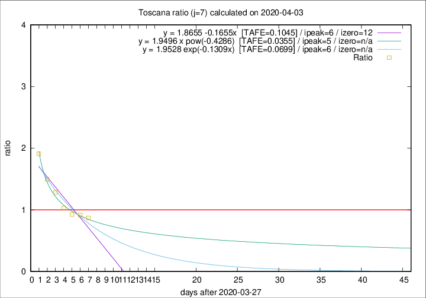

# Toscana

Data source: https://raw.githubusercontent.com/pcm-dpc/COVID-19/master/dati-json/dpc-covid19-ita-regioni.json

Estimates in this page were made on 10/4/2020 with data available until 03/04/2020.

## Summary 

### Peak estimate 
|j|linear [TAFE]|exponential [TAFE]|power law [TAFE]|details|
|---|----|-----------|---------|-------|
|7|3/4/2020 [TAFE=0.1045]|3/4/2020 [TAFE=0.0699]|2/4/2020 [TAFE=0.0355]|[analysis](COVID-19_toscana_j7_2020-04-03.md)|
|8|3/4/2020 [TAFE=0.2426]|3/4/2020 [TAFE=0.1185]|4/4/2020 [TAFE=0.0916]|[analysis](COVID-19_toscana_j8_2020-04-03.md)|
|9|3/4/2020 [TAFE=0.3712]|4/4/2020 [TAFE=0.1068]|6/4/2020 [TAFE=0.1637]|[analysis](COVID-19_toscana_j9_2020-04-03.md)|
|10|3/4/2020 [TAFE=0.4163]|5/4/2020 [TAFE=0.0919]|11/4/2020 [TAFE=0.2476]|[analysis](COVID-19_toscana_j10_2020-04-03.md)|
|11|3/4/2020 [TAFE=0.4282]|6/4/2020 [TAFE=0.1060]|19/4/2020 [TAFE=0.3507]|[analysis](COVID-19_toscana_j11_2020-04-03.md)|
|12|3/4/2020 [TAFE=1.1731]|7/4/2020 [TAFE=0.1882]|24/4/2020 [TAFE=0.3348]|[analysis](COVID-19_toscana_j12_2020-04-03.md)|
|13|3/4/2020 [TAFE=1.1752]|9/4/2020 [TAFE=0.2128]|10/5/2020 [TAFE=0.4538]|[analysis](COVID-19_toscana_j13_2020-04-03.md)|
|14|-|-|-||

Best estimator is pow with j=7 (TAFE=0.0355)
Corresponding peak date estimate is 2/4/2020 (ipeak 5)

Peak date range estimate: 28/3/2020 - 16/5/2020

### End estimate 
|j|linear [TAFE/TFE]|exponential [TAFE/TFE]|power law [TAFE/TFE]|details|
|---|----|-----------|---------|-------|
|7|9/4/2020 [TAFE=0.1045]|-|-|[analysis](COVID-19_toscana_j7_2020-04-03.md)|
|8|-|-|-|[analysis](COVID-19_toscana_j8_2020-04-03.md)|
|9|-|-|-|[analysis](COVID-19_toscana_j9_2020-04-03.md)|
|10|-|-|-|[analysis](COVID-19_toscana_j10_2020-04-03.md)|
|11|-|-|-|[analysis](COVID-19_toscana_j11_2020-04-03.md)|
|12|-|-|-|[analysis](COVID-19_toscana_j12_2020-04-03.md)|
|13|-|-|-|[analysis](COVID-19_toscana_j13_2020-04-03.md)|
|14|-|-|-||

Best estimator is linear with j=7 (TAFE=0.1045)
Corresponding end date estimate is 9/4/2020 (izero 12)

End date range estimate: 28/3/2020 - 9/4/2020

Generated April 10th, 2020 at 17:26:10 UTC+0200 with https://github.com/robianc/COVID-19
