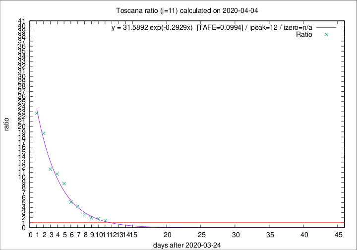

# Toscana

Data source: https://raw.githubusercontent.com/pcm-dpc/COVID-19/master/dati-json/dpc-covid19-ita-regioni.json

Delta days analysis (j): 11

Analyses for other values of j for 2020-04-04 are avalable [here](../2020-04-04/README.md)

Analyses for Toscana for previous dates are avalable [here](../README.md)

## Fitting 
|fit type|best fit equation|tafe|tfe|ipeak|izero|
|-------|-----|--------|------|---|---|
|exp|y = 31.5892 exp(-0.2929x)  [TAFE=0.0994]|0.0994|0.0061|12|n/a|

## Data
|Date|Daily deaths|Cumulated deaths|Deaths in the last 11 days|Deaths in the 11 days before|ratio|
|----|----------|-----------|-------|--------------------|-----|
|2020-04-04|17|307|178|124|1.4355|
|2020-04-03|22|290|181|104|1.7404|
|2020-04-02|15|268|177|90|1.9667|
|2020-04-01|9|253|181|71|2.5493|
|2020-03-31|13|244|197|46|4.2826|
|2020-03-30|16|231|193|38|5.0789|
|2020-03-29|17|215|193|22|8.7727|
|2020-03-28|21|198|181|17|10.6471|
|2020-03-27|19|177|163|14|11.6429|
|2020-03-26|16|158|150|8|18.7500|
|2020-03-25|13|142|136|6|22.6667|

[Download data as CSV](COVID-19_toscana_j11_2020-04-04.csv)

Generated April 16th, 2020 at 20:09:19 UTC+0200 with https://github.com/robianc/COVID-19
