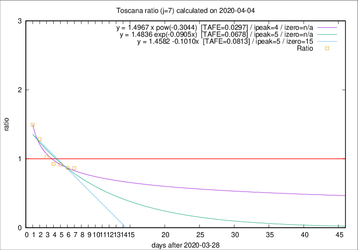

# Toscana

Data source: https://raw.githubusercontent.com/pcm-dpc/COVID-19/master/dati-json/dpc-covid19-ita-regioni.json

Delta days analysis (j): 7

## Fitting 
|fit type|best fit equation|tafe|tfe|ipeak|izero|
|-------|-----|--------|------|---|---|
|linear|y = 1.4582 -0.1010x  [TAFE=0.0813]|0.0813|0.0057|5|15|
|exp|y = 1.4836 exp(-0.0905x)  [TAFE=0.0678]|0.0678|0.0029|5|n/a|
|pow|y = 1.4967 x pow(-0.3044)  [TAFE=0.0297]|0.0297|0.0007|4|n/a|

## Data
|Date|Daily deaths|Cumulated deaths|Deaths in the last 7 days|Deaths in the 7 days before|ratio|
|----|----------|-----------|-------|--------------------|-----|
|2020-04-04|17|307|109|126|0.8651|
|2020-04-03|22|290|113|130|0.8692|
|2020-04-02|15|268|110|120|0.9167|
|2020-04-01|9|253|111|120|0.9250|
|2020-03-31|13|244|115|112|1.0268|
|2020-03-30|16|231|122|95|1.2842|
|2020-03-29|17|215|124|83|1.4940|

[Download data as CSV](COVID-19_toscana_j7_2020-04-04.csv)

Generated April 9th, 2020 at 16:40:48 UTC+0200 with https://github.com/robianc/COVID-19
