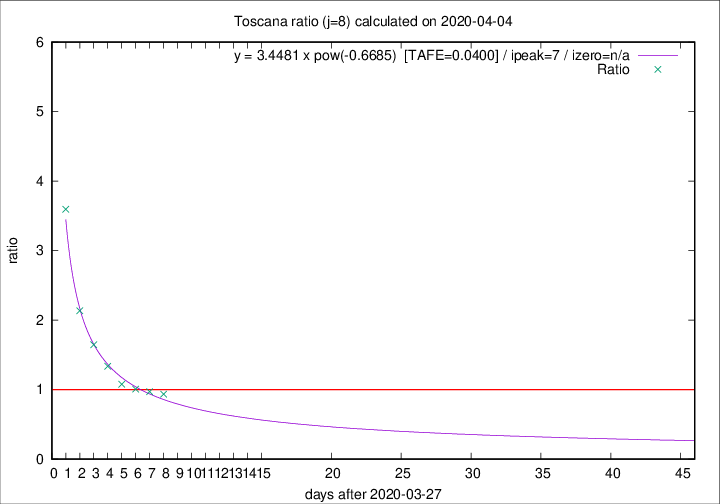

# Toscana

Data source: https://raw.githubusercontent.com/pcm-dpc/COVID-19/master/dati-json/dpc-covid19-ita-regioni.json

Delta days analysis (j): 8

Analyses for other values of j for 2020-04-04 are avalable [here](../2020-04-04/README.md)

Analyses for Toscana for previous dates are avalable [here](../README.md)

## Fitting 
|fit type|best fit equation|tafe|tfe|ipeak|izero|
|-------|-----|--------|------|---|---|
|pow|y = 3.4481 x pow(-0.6685)  [TAFE=0.0400]|0.0400|0.0012|7|n/a|

## Data
|Date|Daily deaths|Cumulated deaths|Deaths in the last 8 days|Deaths in the 8 days before|ratio|
|----|----------|-----------|-------|--------------------|-----|
|2020-04-04|17|307|130|139|0.9353|
|2020-04-03|22|290|132|136|0.9706|
|2020-04-02|15|268|126|125|1.0080|
|2020-04-01|9|253|124|115|1.0783|
|2020-03-31|13|244|135|101|1.3366|
|2020-03-30|16|231|140|85|1.6471|
|2020-03-29|17|215|143|67|2.1343|
|2020-03-28|21|198|151|42|3.5952|

[Download data as CSV](COVID-19_toscana_j8_2020-04-04.csv)

Generated April 16th, 2020 at 20:09:19 UTC+0200 with https://github.com/robianc/COVID-19
