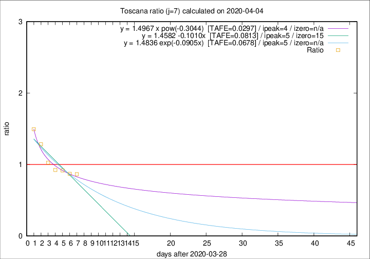

# Toscana

Data source: https://raw.githubusercontent.com/pcm-dpc/COVID-19/master/dati-json/dpc-covid19-ita-regioni.json

Estimates in this page were made on 9/4/2020 with data available until 04/04/2020.

## Summary 

### Peak estimate 
|j|linear [TAFE]|exponential [TAFE]|power law [TAFE]|details|
|---|----|-----------|---------|-------|
|7|3/4/2020 [TAFE=0.0813]|3/4/2020 [TAFE=0.0678]|2/4/2020 [TAFE=0.0297]|[analysis](COVID-19_toscana_j7_2020-04-04.md)|
|8|4/4/2020 [TAFE=0.2527]|4/4/2020 [TAFE=0.1413]|4/4/2020 [TAFE=0.0400]|[analysis](COVID-19_toscana_j8_2020-04-04.md)|
|9|4/4/2020 [TAFE=0.3855]|5/4/2020 [TAFE=0.1504]|6/4/2020 [TAFE=0.0726]|[analysis](COVID-19_toscana_j9_2020-04-04.md)|
|10|4/4/2020 [TAFE=0.3979]|5/4/2020 [TAFE=0.1150]|10/4/2020 [TAFE=0.2287]|[analysis](COVID-19_toscana_j10_2020-04-04.md)|
|11|4/4/2020 [TAFE=0.5393]|6/4/2020 [TAFE=0.0994]|14/4/2020 [TAFE=0.2938]|[analysis](COVID-19_toscana_j11_2020-04-04.md)|
|12|4/4/2020 [TAFE=0.4077]|8/4/2020 [TAFE=0.1462]|27/4/2020 [TAFE=0.4354]|[analysis](COVID-19_toscana_j12_2020-04-04.md)|
|13|3/4/2020 [TAFE=1.5843]|8/4/2020 [TAFE=0.1860]|27/4/2020 [TAFE=0.4087]|[analysis](COVID-19_toscana_j13_2020-04-04.md)|
|14|-|-|-||

Best estimator is pow with j=7 (TAFE=0.0297)
Corresponding peak date estimate is 2/4/2020 (ipeak 4)

Peak date range estimate: 29/3/2020 - 3/5/2020

### End estimate 
|j|linear [TAFE/TFE]|exponential [TAFE/TFE]|power law [TAFE/TFE]|details|
|---|----|-----------|---------|-------|
|7|13/4/2020 [TAFE=0.0813]|-|-|[analysis](COVID-19_toscana_j7_2020-04-04.md)|
|8|-|-|-|[analysis](COVID-19_toscana_j8_2020-04-04.md)|
|9|-|-|-|[analysis](COVID-19_toscana_j9_2020-04-04.md)|
|10|-|-|-|[analysis](COVID-19_toscana_j10_2020-04-04.md)|
|11|-|-|-|[analysis](COVID-19_toscana_j11_2020-04-04.md)|
|12|-|-|-|[analysis](COVID-19_toscana_j12_2020-04-04.md)|
|13|-|-|-|[analysis](COVID-19_toscana_j13_2020-04-04.md)|
|14|-|-|-||

Best estimator is linear with j=7 (TAFE=0.0813)
Corresponding end date estimate is 13/4/2020 (izero 15)

End date range estimate: 29/3/2020 - 13/4/2020

Generated April 9th, 2020 at 16:40:48 UTC+0200 with https://github.com/robianc/COVID-19
