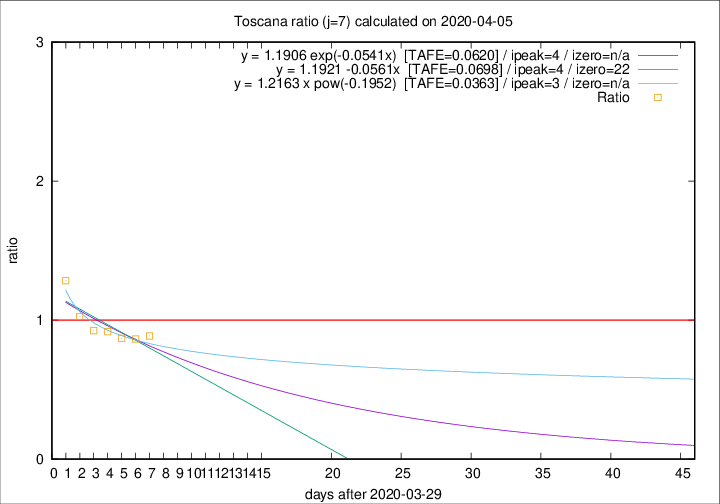

# Toscana

Data source: https://raw.githubusercontent.com/pcm-dpc/COVID-19/master/dati-json/dpc-covid19-ita-regioni.json

Delta days analysis (j): 7

Analyses for other values of j for 2020-04-05 are avalable [here](../2020-04-05/README.md)

Analyses for Toscana for previous dates are avalable [here](../README.md)

## Fitting 
|fit type|best fit equation|tafe|tfe|ipeak|izero|
|-------|-----|--------|------|---|---|
|linear|y = 1.1921 -0.0561x  [TAFE=0.0698]|0.0698|0.0054|4|22|
|exp|y = 1.1906 exp(-0.0541x)  [TAFE=0.0620]|0.0620|0.0026|4|n/a|
|pow|y = 1.2163 x pow(-0.1952)  [TAFE=0.0363]|0.0363|0.0009|3|n/a|

## Data
|Date|Daily deaths|Cumulated deaths|Deaths in the last 7 days|Deaths in the 7 days before|ratio|
|----|----------|-----------|-------|--------------------|-----|
|2020-04-05|18|325|110|124|0.8871|
|2020-04-04|17|307|109|126|0.8651|
|2020-04-03|22|290|113|130|0.8692|
|2020-04-02|15|268|110|120|0.9167|
|2020-04-01|9|253|111|120|0.9250|
|2020-03-31|13|244|115|112|1.0268|
|2020-03-30|16|231|122|95|1.2842|

[Download data as CSV](COVID-19_toscana_j7_2020-04-05.csv)

Generated April 19th, 2020 at 18:42:39 UTC+0200 with https://github.com/robianc/COVID-19
