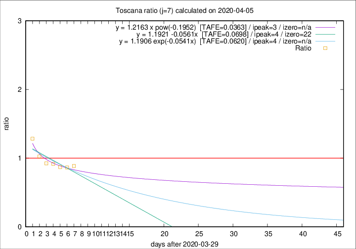

# Toscana

Data source: https://raw.githubusercontent.com/pcm-dpc/COVID-19/master/dati-json/dpc-covid19-ita-regioni.json

Estimates in this page were made on 8/4/2020 with data available until 05/04/2020.

## Summary 

### Peak estimate 
|j|linear [TAFE]|exponential [TAFE]|power law [TAFE]|details|
|---|----|-----------|---------|-------|
|7|3/4/2020 [TAFE=0.0698]|3/4/2020 [TAFE=0.0620]|2/4/2020 [TAFE=0.0363]|[analysis](COVID-19_toscana_j7_2020-04-05.md)|
|8|4/4/2020 [TAFE=0.1237]|4/4/2020 [TAFE=0.0845]|4/4/2020 [TAFE=0.0288]|[analysis](COVID-19_toscana_j8_2020-04-05.md)|
|9|5/4/2020 [TAFE=0.2791]|5/4/2020 [TAFE=0.1395]|6/4/2020 [TAFE=0.0726]|[analysis](COVID-19_toscana_j9_2020-04-05.md)|
|10|5/4/2020 [TAFE=0.4614]|6/4/2020 [TAFE=0.1534]|8/4/2020 [TAFE=0.1345]|[analysis](COVID-19_toscana_j10_2020-04-05.md)|
|11|5/4/2020 [TAFE=0.5499]|7/4/2020 [TAFE=0.1224]|12/4/2020 [TAFE=0.2319]|[analysis](COVID-19_toscana_j11_2020-04-05.md)|
|12|5/4/2020 [TAFE=0.6104]|8/4/2020 [TAFE=0.1012]|18/4/2020 [TAFE=0.3573]|[analysis](COVID-19_toscana_j12_2020-04-05.md)|
|13|4/4/2020 [TAFE=1.5327]|9/4/2020 [TAFE=0.1853]|22/4/2020 [TAFE=0.3461]|[analysis](COVID-19_toscana_j13_2020-04-05.md)|
|14|4/4/2020 [TAFE=1.6525]|10/4/2020 [TAFE=0.1962]|4/5/2020 [TAFE=0.4898]|[analysis](COVID-19_toscana_j14_2020-04-05.md)|

Best estimator is pow with j=8 (TAFE=0.0288)
Corresponding peak date estimate is 4/4/2020 (ipeak 6)

Peak date range estimate: 1/4/2020 - 10/5/2020

### End estimate 
|j|linear [TAFE/TFE]|exponential [TAFE/TFE]|power law [TAFE/TFE]|details|
|---|----|-----------|---------|-------|
|7|21/4/2020 [TAFE=0.0698]|-|-|[analysis](COVID-19_toscana_j7_2020-04-05.md)|
|8|-|-|-|[analysis](COVID-19_toscana_j8_2020-04-05.md)|
|9|-|-|-|[analysis](COVID-19_toscana_j9_2020-04-05.md)|
|10|-|-|-|[analysis](COVID-19_toscana_j10_2020-04-05.md)|
|11|-|-|-|[analysis](COVID-19_toscana_j11_2020-04-05.md)|
|12|-|-|-|[analysis](COVID-19_toscana_j12_2020-04-05.md)|
|13|-|-|-|[analysis](COVID-19_toscana_j13_2020-04-05.md)|
|14|-|-|-|[analysis](COVID-19_toscana_j14_2020-04-05.md)|

Best estimator is linear with j=7 (TAFE=0.0698)
Corresponding end date estimate is 21/4/2020 (izero 22)

End date range estimate: 30/3/2020 - 21/4/2020

Generated April 8th, 2020 at 23:43:36 UTC+0200 with https://github.com/robianc/COVID-19
