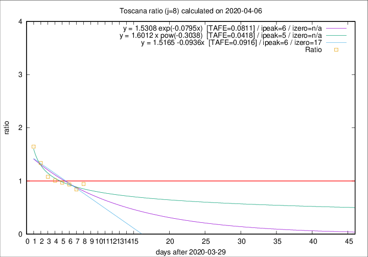

# Toscana

Data source: https://raw.githubusercontent.com/pcm-dpc/COVID-19/master/dati-json/dpc-covid19-ita-regioni.json

Delta days analysis (j): 8

## Fitting 
|fit type|best fit equation|tafe|tfe|ipeak|izero|
|-------|-----|--------|------|---|---|
|linear|y = 1.5165 -0.0936x  [TAFE=0.0916]|0.0916|0.0095|6|17|
|exp|y = 1.5308 exp(-0.0795x)  [TAFE=0.0811]|0.0811|0.0045|6|n/a|
|pow|y = 1.6012 x pow(-0.3038)  [TAFE=0.0418]|0.0418|0.0012|5|n/a|

## Data
|Date|Daily deaths|Cumulated deaths|Deaths in the last 8 days|Deaths in the 8 days before|ratio|
|----|----------|-----------|-------|--------------------|-----|
|2020-04-06|25|350|135|143|0.9441|
|2020-04-05|18|325|127|151|0.8411|
|2020-04-04|17|307|130|139|0.9353|
|2020-04-03|22|290|132|136|0.9706|
|2020-04-02|15|268|126|125|1.0080|
|2020-04-01|9|253|124|115|1.0783|
|2020-03-31|13|244|135|101|1.3366|
|2020-03-30|16|231|140|85|1.6471|

[Download data as CSV](COVID-19_toscana_j8_2020-04-06.csv)

Generated April 8th, 2020 at 23:43:36 UTC+0200 with https://github.com/robianc/COVID-19
