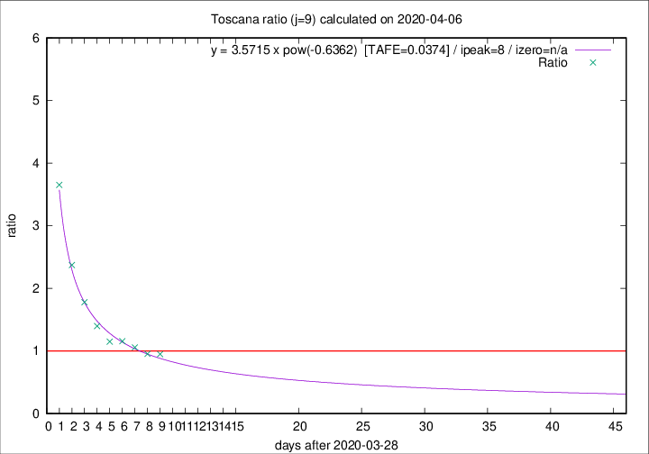

# Toscana

Data source: https://raw.githubusercontent.com/pcm-dpc/COVID-19/master/dati-json/dpc-covid19-ita-regioni.json

Delta days analysis (j): 9

Analyses for other values of j for 2020-04-06 are avalable [here](../2020-04-06/README.md)

Analyses for Toscana for previous dates are avalable [here](../README.md)

## Fitting 
|fit type|best fit equation|tafe|tfe|ipeak|izero|
|-------|-----|--------|------|---|---|
|pow|y = 3.5715 x pow(-0.6362)  [TAFE=0.0374]|0.0374|0.0013|8|n/a|

## Data
|Date|Daily deaths|Cumulated deaths|Deaths in the last 9 days|Deaths in the 9 days before|ratio|
|----|----------|-----------|-------|--------------------|-----|
|2020-04-06|25|350|152|160|0.9500|
|2020-04-05|18|325|148|155|0.9548|
|2020-04-04|17|307|149|141|1.0567|
|2020-04-03|22|290|148|128|1.1562|
|2020-04-02|15|268|139|121|1.1488|
|2020-04-01|9|253|144|103|1.3981|
|2020-03-31|13|244|153|86|1.7791|
|2020-03-30|16|231|159|67|2.3731|
|2020-03-29|17|215|168|46|3.6522|

[Download data as CSV](COVID-19_toscana_j9_2020-04-06.csv)

Generated April 19th, 2020 at 18:42:39 UTC+0200 with https://github.com/robianc/COVID-19
