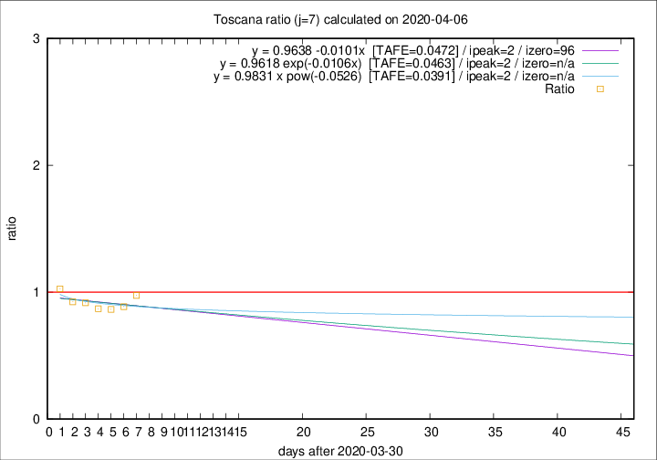

# Toscana

Data source: https://raw.githubusercontent.com/pcm-dpc/COVID-19/master/dati-json/dpc-covid19-ita-regioni.json

Estimates in this page were made on 12/4/2020 with data available until 06/04/2020.

## Summary 

### Peak estimate 
|j|linear [TAFE]|exponential [TAFE]|power law [TAFE]|details|
|---|----|-----------|---------|-------|
|7|2/4/2020 [TAFE=0.0472]|2/4/2020 [TAFE=0.0463]|2/4/2020 [TAFE=0.0391]|[analysis](COVID-19_toscana_j7_2020-04-06.md)|
|8|5/4/2020 [TAFE=0.0916]|5/4/2020 [TAFE=0.0811]|4/4/2020 [TAFE=0.0418]|[analysis](COVID-19_toscana_j8_2020-04-06.md)|
|9|6/4/2020 [TAFE=0.2315]|6/4/2020 [TAFE=0.1302]|6/4/2020 [TAFE=0.0374]|[analysis](COVID-19_toscana_j9_2020-04-06.md)|
|10|6/4/2020 [TAFE=0.4266]|7/4/2020 [TAFE=0.1751]|8/4/2020 [TAFE=0.0670]|[analysis](COVID-19_toscana_j10_2020-04-06.md)|
|11|6/4/2020 [TAFE=0.5091]|7/4/2020 [TAFE=0.1488]|11/4/2020 [TAFE=0.2040]|[analysis](COVID-19_toscana_j11_2020-04-06.md)|
|12|6/4/2020 [TAFE=0.7095]|8/4/2020 [TAFE=0.1213]|15/4/2020 [TAFE=0.2733]|[analysis](COVID-19_toscana_j12_2020-04-06.md)|
|13|6/4/2020 [TAFE=0.5835]|9/4/2020 [TAFE=0.1431]|25/4/2020 [TAFE=0.4413]|[analysis](COVID-19_toscana_j13_2020-04-06.md)|
|14|5/4/2020 [TAFE=2.0384]|10/4/2020 [TAFE=0.1844]|25/4/2020 [TAFE=0.4083]|[analysis](COVID-19_toscana_j14_2020-04-06.md)|

Best estimator is pow with j=9 (TAFE=0.0374)
Corresponding peak date estimate is 6/4/2020 (ipeak 8)

Peak date range estimate: 31/3/2020 - 30/4/2020

### End estimate 
|j|linear [TAFE/TFE]|exponential [TAFE/TFE]|power law [TAFE/TFE]|details|
|---|----|-----------|---------|-------|
|7|5/7/2020 [TAFE=0.0472]|-|-|[analysis](COVID-19_toscana_j7_2020-04-06.md)|
|8|-|-|-|[analysis](COVID-19_toscana_j8_2020-04-06.md)|
|9|-|-|-|[analysis](COVID-19_toscana_j9_2020-04-06.md)|
|10|-|-|-|[analysis](COVID-19_toscana_j10_2020-04-06.md)|
|11|-|-|-|[analysis](COVID-19_toscana_j11_2020-04-06.md)|
|12|-|-|-|[analysis](COVID-19_toscana_j12_2020-04-06.md)|
|13|-|-|-|[analysis](COVID-19_toscana_j13_2020-04-06.md)|
|14|-|-|-|[analysis](COVID-19_toscana_j14_2020-04-06.md)|

Best estimator is linear with j=7 (TAFE=0.0472)
Corresponding end date estimate is 5/7/2020 (izero 96)

End date range estimate: 31/3/2020 - 5/7/2020

Generated April 12th, 2020 at 16:28:18 UTC+0200 with https://github.com/robianc/COVID-19
