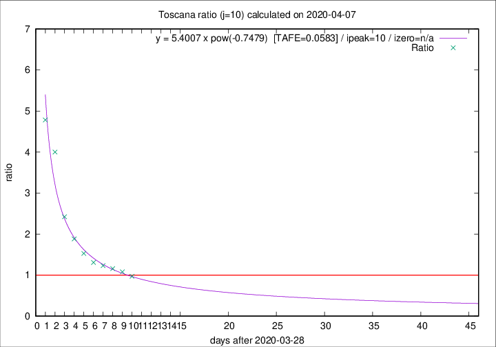

# Toscana

Data source: https://raw.githubusercontent.com/pcm-dpc/COVID-19/master/dati-json/dpc-covid19-ita-regioni.json

Delta days analysis (j): 10

Analyses for other values of j for 2020-04-07 are avalable [here](../2020-04-07/README.md)

Analyses for Toscana for previous dates are avalable [here](../README.md)

## Fitting 
|fit type|best fit equation|tafe|tfe|ipeak|izero|
|-------|-----|--------|------|---|---|
|pow|y = 5.4007 x pow(-0.7479)  [TAFE=0.0583]|0.0583|0.0036|10|n/a|

## Data
|Date|Daily deaths|Cumulated deaths|Deaths in the last 10 days|Deaths in the 10 days before|ratio|
|----|----------|-----------|-------|--------------------|-----|
|2020-04-07|19|369|171|176|0.9716|
|2020-04-06|25|350|173|160|1.0813|
|2020-04-05|18|325|167|144|1.1597|
|2020-04-04|17|307|165|134|1.2313|
|2020-04-03|22|290|161|123|1.3089|
|2020-04-02|15|268|159|104|1.5288|
|2020-04-01|9|253|162|86|1.8837|
|2020-03-31|13|244|172|71|2.4225|
|2020-03-30|16|231|184|46|4.0000|
|2020-03-29|17|215|177|37|4.7838|

[Download data as CSV](COVID-19_toscana_j10_2020-04-07.csv)

Generated April 12th, 2020 at 17:02:01 UTC+0200 with https://github.com/robianc/COVID-19
