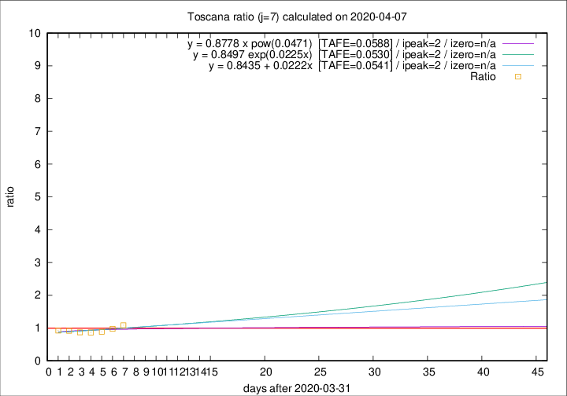

# Toscana

Data source: https://raw.githubusercontent.com/pcm-dpc/COVID-19/master/dati-json/dpc-covid19-ita-regioni.json

Delta days analysis (j): 7

## Fitting 
|fit type|best fit equation|tafe|tfe|ipeak|izero|
|-------|-----|--------|------|---|---|
|linear|y = 0.8435 + 0.0222x  [TAFE=0.0541]|0.0541|0.0036|2|n/a|
|exp|y = 0.8497 exp(0.0225x)  [TAFE=0.0530]|0.0530|0.0019|2|n/a|
|pow|y = 0.8778 x pow(0.0471)  [TAFE=0.0588]|0.0588|0.0024|2|n/a|

## Data
|Date|Daily deaths|Cumulated deaths|Deaths in the last 7 days|Deaths in the 7 days before|ratio|
|----|----------|-----------|-------|--------------------|-----|
|2020-04-07|19|369|125|115|1.0870|
|2020-04-06|25|350|119|122|0.9754|
|2020-04-05|18|325|110|124|0.8871|
|2020-04-04|17|307|109|126|0.8651|
|2020-04-03|22|290|113|130|0.8692|
|2020-04-02|15|268|110|120|0.9167|
|2020-04-01|9|253|111|120|0.9250|

[Download data as CSV](COVID-19_toscana_j7_2020-04-07.csv)

Generated April 8th, 2020 at 23:43:36 UTC+0200 with https://github.com/robianc/COVID-19
