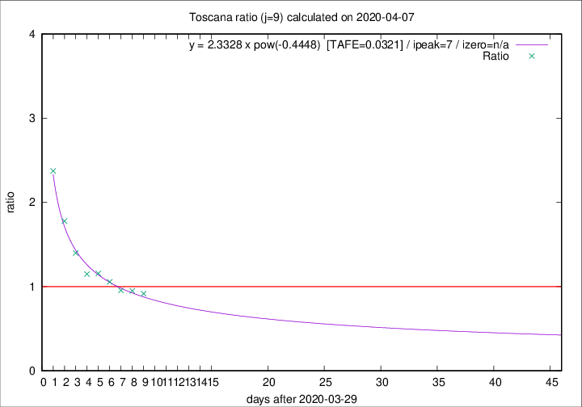
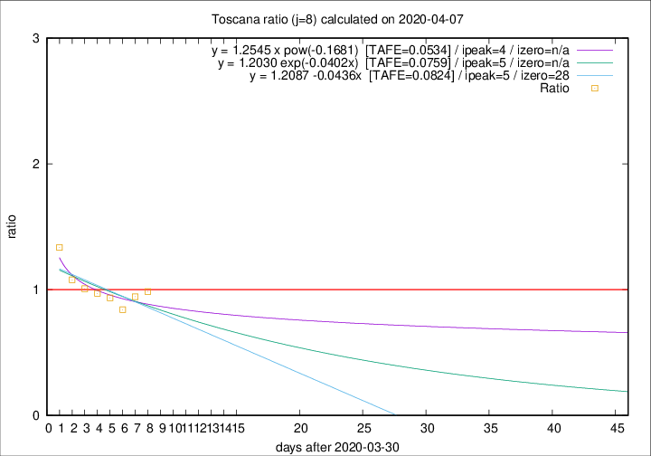

# Toscana

Data source: https://raw.githubusercontent.com/pcm-dpc/COVID-19/master/dati-json/dpc-covid19-ita-regioni.json

Estimates in this page were made on 10/4/2020 with data available until 07/04/2020.

## Summary 

### Peak estimate 
|j|linear [TAFE]|exponential [TAFE]|power law [TAFE]|details|
|---|----|-----------|---------|-------|
|7|3/4/2020 [TAFE=0.0541]|3/4/2020 [TAFE=0.0530]|3/4/2020 [TAFE=0.0588]|[analysis](COVID-19_toscana_j7_2020-04-07.md)|
|8|5/4/2020 [TAFE=0.0824]|5/4/2020 [TAFE=0.0759]|4/4/2020 [TAFE=0.0534]|[analysis](COVID-19_toscana_j8_2020-04-07.md)|
|9|6/4/2020 [TAFE=0.1384]|6/4/2020 [TAFE=0.0982]|6/4/2020 [TAFE=0.0321]|[analysis](COVID-19_toscana_j9_2020-04-07.md)|
|10|7/4/2020 [TAFE=0.3151]|7/4/2020 [TAFE=0.1599]|8/4/2020 [TAFE=0.0583]|[analysis](COVID-19_toscana_j10_2020-04-07.md)|
|11|7/4/2020 [TAFE=0.5566]|8/4/2020 [TAFE=0.1851]|10/4/2020 [TAFE=0.1175]|[analysis](COVID-19_toscana_j11_2020-04-07.md)|
|12|6/4/2020 [TAFE=0.6803]|8/4/2020 [TAFE=0.1631]|13/4/2020 [TAFE=0.2001]|[analysis](COVID-19_toscana_j12_2020-04-07.md)|
|13|6/4/2020 [TAFE=0.7978]|9/4/2020 [TAFE=0.1302]|19/4/2020 [TAFE=0.3396]|[analysis](COVID-19_toscana_j13_2020-04-07.md)|
|14|6/4/2020 [TAFE=1.8217]|10/4/2020 [TAFE=0.1824]|22/4/2020 [TAFE=0.3534]|[analysis](COVID-19_toscana_j14_2020-04-07.md)|

Best estimator is pow with j=9 (TAFE=0.0321)
Corresponding peak date estimate is 6/4/2020 (ipeak 7)

Peak date range estimate: 1/4/2020 - 27/4/2020

### End estimate 
|j|linear [TAFE/TFE]|exponential [TAFE/TFE]|power law [TAFE/TFE]|details|
|---|----|-----------|---------|-------|
|7|-|-|-|[analysis](COVID-19_toscana_j7_2020-04-07.md)|
|8|28/4/2020 [TAFE=0.0824]|-|-|[analysis](COVID-19_toscana_j8_2020-04-07.md)|
|9|-|-|-|[analysis](COVID-19_toscana_j9_2020-04-07.md)|
|10|-|-|-|[analysis](COVID-19_toscana_j10_2020-04-07.md)|
|11|-|-|-|[analysis](COVID-19_toscana_j11_2020-04-07.md)|
|12|-|-|-|[analysis](COVID-19_toscana_j12_2020-04-07.md)|
|13|-|-|-|[analysis](COVID-19_toscana_j13_2020-04-07.md)|
|14|-|-|-|[analysis](COVID-19_toscana_j14_2020-04-07.md)|

Best estimator is linear with j=8 (TAFE=0.0824)
Corresponding end date estimate is 28/4/2020 (izero 28)

End date range estimate: 31/3/2020 - 28/4/2020

Generated April 10th, 2020 at 17:26:10 UTC+0200 with https://github.com/robianc/COVID-19
