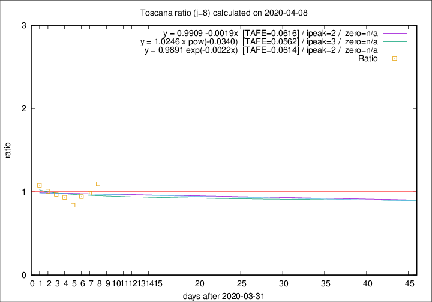

# Toscana

Data source: https://raw.githubusercontent.com/pcm-dpc/COVID-19/master/dati-json/dpc-covid19-ita-regioni.json

Delta days analysis (j): 8

## Fitting 
|fit type|best fit equation|tafe|tfe|ipeak|izero|
|-------|-----|--------|------|---|---|
|linear|y = 0.9909 -0.0019x  [TAFE=0.0616]|0.0616|0.0061|2|n/a|
|exp|y = 0.9891 exp(-0.0022x)  [TAFE=0.0614]|0.0614|0.0031|2|n/a|
|pow|y = 1.0246 x pow(-0.0340)  [TAFE=0.0562]|0.0562|0.0029|3|n/a|

## Data
|Date|Daily deaths|Cumulated deaths|Deaths in the last 8 days|Deaths in the 8 days before|ratio|
|----|----------|-----------|-------|--------------------|-----|
|2020-04-08|23|392|148|135|1.0963|
|2020-04-07|19|369|138|140|0.9857|
|2020-04-06|25|350|135|143|0.9441|
|2020-04-05|18|325|127|151|0.8411|
|2020-04-04|17|307|130|139|0.9353|
|2020-04-03|22|290|132|136|0.9706|
|2020-04-02|15|268|126|125|1.0080|
|2020-04-01|9|253|124|115|1.0783|

[Download data as CSV](COVID-19_toscana_j8_2020-04-08.csv)

Generated April 9th, 2020 at 16:40:48 UTC+0200 with https://github.com/robianc/COVID-19
