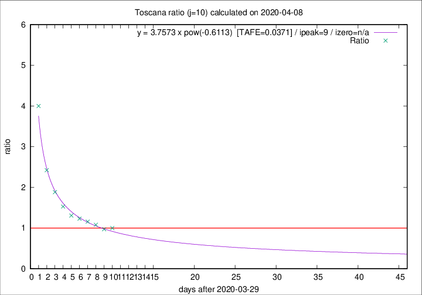
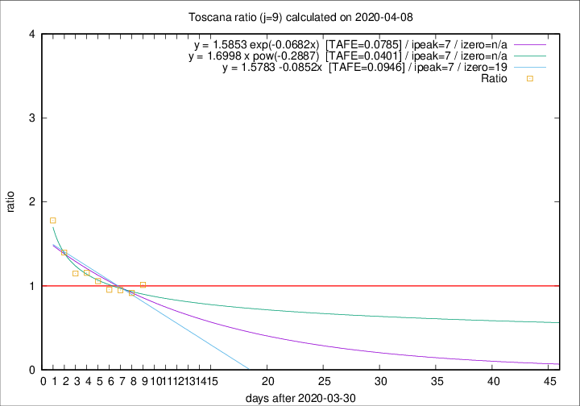

# Toscana

Data source: https://raw.githubusercontent.com/pcm-dpc/COVID-19/master/dati-json/dpc-covid19-ita-regioni.json

Estimates in this page were made on 12/4/2020 with data available until 08/04/2020.

## Summary 

### Peak estimate 
|j|linear [TAFE]|exponential [TAFE]|power law [TAFE]|details|
|---|----|-----------|---------|-------|
|7|4/4/2020 [TAFE=0.0620]|4/4/2020 [TAFE=0.0578]|4/4/2020 [TAFE=0.0849]|[analysis](COVID-19_toscana_j7_2020-04-08.md)|
|8|-|-|4/4/2020 [TAFE=0.0562]|[analysis](COVID-19_toscana_j8_2020-04-08.md)|
|9|7/4/2020 [TAFE=0.0946]|7/4/2020 [TAFE=0.0785]|7/4/2020 [TAFE=0.0401]|[analysis](COVID-19_toscana_j9_2020-04-08.md)|
|10|8/4/2020 [TAFE=0.2390]|8/4/2020 [TAFE=0.1290]|8/4/2020 [TAFE=0.0371]|[analysis](COVID-19_toscana_j10_2020-04-08.md)|
|11|7/4/2020 [TAFE=0.4664]|8/4/2020 [TAFE=0.1941]|10/4/2020 [TAFE=0.0616]|[analysis](COVID-19_toscana_j11_2020-04-08.md)|
|12|7/4/2020 [TAFE=0.6188]|9/4/2020 [TAFE=0.1873]|13/4/2020 [TAFE=0.1728]|[analysis](COVID-19_toscana_j12_2020-04-08.md)|
|13|7/4/2020 [TAFE=0.8624]|10/4/2020 [TAFE=0.1632]|16/4/2020 [TAFE=0.2467]|[analysis](COVID-19_toscana_j13_2020-04-08.md)|
|14|7/4/2020 [TAFE=0.7749]|11/4/2020 [TAFE=0.1487]|25/4/2020 [TAFE=0.4319]|[analysis](COVID-19_toscana_j14_2020-04-08.md)|

Best estimator is pow with j=10 (TAFE=0.0371)
Corresponding peak date estimate is 8/4/2020 (ipeak 9)

Peak date range estimate: 30/3/2020 - 29/4/2020

### End estimate 
|j|linear [TAFE/TFE]|exponential [TAFE/TFE]|power law [TAFE/TFE]|details|
|---|----|-----------|---------|-------|
|7|-|-|-|[analysis](COVID-19_toscana_j7_2020-04-08.md)|
|8|-|-|-|[analysis](COVID-19_toscana_j8_2020-04-08.md)|
|9|19/4/2020 [TAFE=0.0946]|-|-|[analysis](COVID-19_toscana_j9_2020-04-08.md)|
|10|-|-|-|[analysis](COVID-19_toscana_j10_2020-04-08.md)|
|11|-|-|-|[analysis](COVID-19_toscana_j11_2020-04-08.md)|
|12|-|-|-|[analysis](COVID-19_toscana_j12_2020-04-08.md)|
|13|-|-|-|[analysis](COVID-19_toscana_j13_2020-04-08.md)|
|14|-|-|-|[analysis](COVID-19_toscana_j14_2020-04-08.md)|

Best estimator is linear with j=9 (TAFE=0.0946)
Corresponding end date estimate is 19/4/2020 (izero 19)

End date range estimate: 31/3/2020 - 19/4/2020

Generated April 12th, 2020 at 17:02:01 UTC+0200 with https://github.com/robianc/COVID-19
