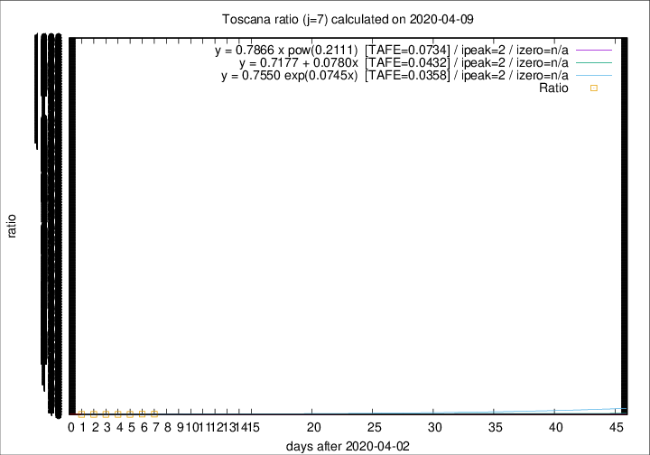

# Toscana

Data source: https://raw.githubusercontent.com/pcm-dpc/COVID-19/master/dati-json/dpc-covid19-ita-regioni.json

Delta days analysis (j): 7

Analyses for other values of j for 2020-04-09 are avalable [here](../2020-04-09/README.md)

Analyses for Toscana for previous dates are avalable [here](../README.md)

## Fitting 
|fit type|best fit equation|tafe|tfe|ipeak|izero|
|-------|-----|--------|------|---|---|
|linear|y = 0.7177 + 0.0780x  [TAFE=0.0432]|0.0432|0.0018|2|n/a|
|exp|y = 0.7550 exp(0.0745x)  [TAFE=0.0358]|0.0358|0.0008|2|n/a|
|pow|y = 0.7866 x pow(0.2111)  [TAFE=0.0734]|0.0734|0.0031|2|n/a|

## Data
|Date|Daily deaths|Cumulated deaths|Deaths in the last 7 days|Deaths in the 7 days before|ratio|
|----|----------|-----------|-------|--------------------|-----|
|2020-04-09|16|408|140|110|1.2727|
|2020-04-08|23|392|139|111|1.2523|
|2020-04-07|19|369|125|115|1.0870|
|2020-04-06|25|350|119|122|0.9754|
|2020-04-05|18|325|110|124|0.8871|
|2020-04-04|17|307|109|126|0.8651|
|2020-04-03|22|290|113|130|0.8692|

[Download data as CSV](COVID-19_toscana_j7_2020-04-09.csv)

Generated April 12th, 2020 at 17:02:01 UTC+0200 with https://github.com/robianc/COVID-19
