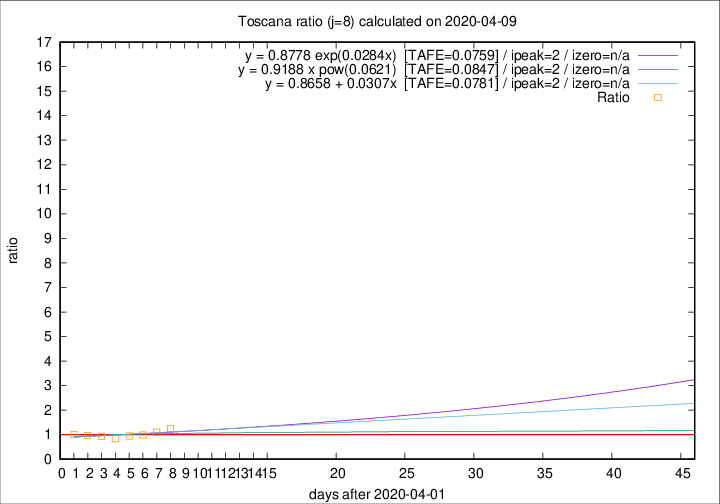

# Toscana

Data source: https://raw.githubusercontent.com/pcm-dpc/COVID-19/master/dati-json/dpc-covid19-ita-regioni.json

Delta days analysis (j): 8

Analyses for other values of j for 2020-04-09 are avalable [here](../2020-04-09/README.md)

Analyses for Toscana for previous dates are avalable [here](../README.md)

## Fitting 
|fit type|best fit equation|tafe|tfe|ipeak|izero|
|-------|-----|--------|------|---|---|
|linear|y = 0.8658 + 0.0307x  [TAFE=0.0781]|0.0781|0.0080|2|n/a|
|exp|y = 0.8778 exp(0.0284x)  [TAFE=0.0759]|0.0759|0.0038|2|n/a|
|pow|y = 0.9188 x pow(0.0621)  [TAFE=0.0847]|0.0847|0.0052|2|n/a|

## Data
|Date|Daily deaths|Cumulated deaths|Deaths in the last 8 days|Deaths in the 8 days before|ratio|
|----|----------|-----------|-------|--------------------|-----|
|2020-04-09|16|408|155|124|1.2500|
|2020-04-08|23|392|148|135|1.0963|
|2020-04-07|19|369|138|140|0.9857|
|2020-04-06|25|350|135|143|0.9441|
|2020-04-05|18|325|127|151|0.8411|
|2020-04-04|17|307|130|139|0.9353|
|2020-04-03|22|290|132|136|0.9706|
|2020-04-02|15|268|126|125|1.0080|

[Download data as CSV](COVID-19_toscana_j8_2020-04-09.csv)

Generated April 14th, 2020 at 19:16:04 UTC+0200 with https://github.com/robianc/COVID-19
