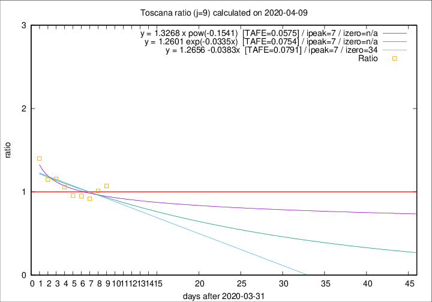

# Toscana

Data source: https://raw.githubusercontent.com/pcm-dpc/COVID-19/master/dati-json/dpc-covid19-ita-regioni.json

Delta days analysis (j): 9

Analyses for other values of j for 2020-04-09 are avalable [here](../2020-04-09/README.md)

Analyses for Toscana for previous dates are avalable [here](../README.md)

## Fitting 
|fit type|best fit equation|tafe|tfe|ipeak|izero|
|-------|-----|--------|------|---|---|
|linear|y = 1.2656 -0.0383x  [TAFE=0.0791]|0.0791|0.0078|7|34|
|exp|y = 1.2601 exp(-0.0335x)  [TAFE=0.0754]|0.0754|0.0040|7|n/a|
|pow|y = 1.3268 x pow(-0.1541)  [TAFE=0.0575]|0.0575|0.0022|7|n/a|

## Data
|Date|Daily deaths|Cumulated deaths|Deaths in the last 9 days|Deaths in the 9 days before|ratio|
|----|----------|-----------|-------|--------------------|-----|
|2020-04-09|16|408|164|153|1.0719|
|2020-04-08|23|392|161|159|1.0126|
|2020-04-07|19|369|154|168|0.9167|
|2020-04-06|25|350|152|160|0.9500|
|2020-04-05|18|325|148|155|0.9548|
|2020-04-04|17|307|149|141|1.0567|
|2020-04-03|22|290|148|128|1.1562|
|2020-04-02|15|268|139|121|1.1488|
|2020-04-01|9|253|144|103|1.3981|

[Download data as CSV](COVID-19_toscana_j9_2020-04-09.csv)

Generated April 19th, 2020 at 18:42:39 UTC+0200 with https://github.com/robianc/COVID-19
