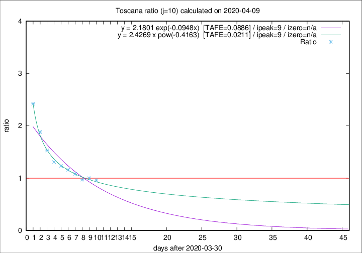

# Toscana

Data source: https://raw.githubusercontent.com/pcm-dpc/COVID-19/master/dati-json/dpc-covid19-ita-regioni.json

Estimates in this page were made on 12/4/2020 with data available until 09/04/2020.

## Summary 

### Peak estimate 
|j|linear [TAFE]|exponential [TAFE]|power law [TAFE]|details|
|---|----|-----------|---------|-------|
|7|5/4/2020 [TAFE=0.0432]|5/4/2020 [TAFE=0.0358]|5/4/2020 [TAFE=0.0734]|[analysis](COVID-19_toscana_j7_2020-04-09.md)|
|8|4/4/2020 [TAFE=0.0781]|4/4/2020 [TAFE=0.0759]|4/4/2020 [TAFE=0.0847]|[analysis](COVID-19_toscana_j8_2020-04-09.md)|
|9|8/4/2020 [TAFE=0.0791]|8/4/2020 [TAFE=0.0754]|8/4/2020 [TAFE=0.0575]|[analysis](COVID-19_toscana_j9_2020-04-09.md)|
|10|9/4/2020 [TAFE=0.1248]|9/4/2020 [TAFE=0.0886]|9/4/2020 [TAFE=0.0211]|[analysis](COVID-19_toscana_j10_2020-04-09.md)|
|11|9/4/2020 [TAFE=0.3184]|9/4/2020 [TAFE=0.1592]|10/4/2020 [TAFE=0.0495]|[analysis](COVID-19_toscana_j11_2020-04-09.md)|
|12|8/4/2020 [TAFE=0.6078]|10/4/2020 [TAFE=0.2016]|12/4/2020 [TAFE=0.0959]|[analysis](COVID-19_toscana_j12_2020-04-09.md)|
|13|8/4/2020 [TAFE=0.7961]|10/4/2020 [TAFE=0.1954]|15/4/2020 [TAFE=0.1746]|[analysis](COVID-19_toscana_j13_2020-04-09.md)|
|14|8/4/2020 [TAFE=0.9649]|11/4/2020 [TAFE=0.1502]|20/4/2020 [TAFE=0.3177]|[analysis](COVID-19_toscana_j14_2020-04-09.md)|

Best estimator is pow with j=10 (TAFE=0.0211)
Corresponding peak date estimate is 9/4/2020 (ipeak 9)

Peak date range estimate: 2/4/2020 - 24/4/2020

### End estimate 
|j|linear [TAFE/TFE]|exponential [TAFE/TFE]|power law [TAFE/TFE]|details|
|---|----|-----------|---------|-------|
|7|-|-|-|[analysis](COVID-19_toscana_j7_2020-04-09.md)|
|8|-|-|-|[analysis](COVID-19_toscana_j8_2020-04-09.md)|
|9|5/5/2020 [TAFE=0.0791]|-|-|[analysis](COVID-19_toscana_j9_2020-04-09.md)|
|10|-|-|-|[analysis](COVID-19_toscana_j10_2020-04-09.md)|
|11|-|-|-|[analysis](COVID-19_toscana_j11_2020-04-09.md)|
|12|-|-|-|[analysis](COVID-19_toscana_j12_2020-04-09.md)|
|13|-|-|-|[analysis](COVID-19_toscana_j13_2020-04-09.md)|
|14|-|-|-|[analysis](COVID-19_toscana_j14_2020-04-09.md)|

Best estimator is linear with j=9 (TAFE=0.0791)
Corresponding end date estimate is 5/5/2020 (izero 34)

End date range estimate: 1/4/2020 - 5/5/2020

Generated April 12th, 2020 at 16:28:18 UTC+0200 with https://github.com/robianc/COVID-19
