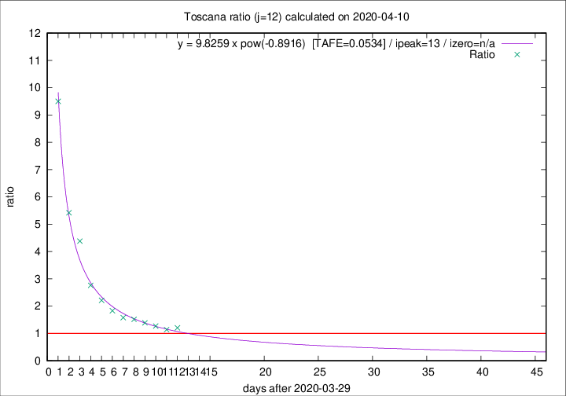

# Toscana

Data source: https://raw.githubusercontent.com/pcm-dpc/COVID-19/master/dati-json/dpc-covid19-ita-regioni.json

Delta days analysis (j): 12

Analyses for other values of j for 2020-04-10 are avalable [here](../2020-04-10/README.md)

Analyses for Toscana for previous dates are avalable [here](../README.md)

## Fitting 
|fit type|best fit equation|tafe|tfe|ipeak|izero|
|-------|-----|--------|------|---|---|
|pow|y = 9.8259 x pow(-0.8916)  [TAFE=0.0534]|0.0534|0.0027|13|n/a|

## Data
|Date|Daily deaths|Cumulated deaths|Deaths in the last 12 days|Deaths in the 12 days before|ratio|
|----|----------|-----------|-------|--------------------|-----|
|2020-04-10|46|454|239|198|1.2071|
|2020-04-09|16|408|210|184|1.1413|
|2020-04-08|23|392|215|169|1.2722|
|2020-04-07|19|369|211|152|1.3882|
|2020-04-06|25|350|208|137|1.5182|
|2020-04-05|18|325|196|124|1.5806|
|2020-04-04|17|307|198|108|1.8333|
|2020-04-03|22|290|199|90|2.2111|
|2020-04-02|15|268|196|71|2.7606|
|2020-04-01|9|253|206|47|4.3830|
|2020-03-31|13|244|206|38|5.4211|
|2020-03-30|16|231|209|22|9.5000|

[Download data as CSV](COVID-19_toscana_j12_2020-04-10.csv)

Generated April 14th, 2020 at 19:16:04 UTC+0200 with https://github.com/robianc/COVID-19
