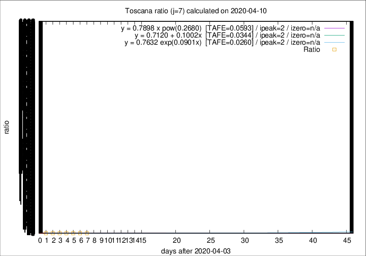

# Toscana

Data source: https://raw.githubusercontent.com/pcm-dpc/COVID-19/master/dati-json/dpc-covid19-ita-regioni.json

Estimates in this page were made on 19/4/2020 with data available until 10/04/2020.

## Summary 

### Peak estimate 
|j|linear [TAFE]|exponential [TAFE]|power law [TAFE]|details|
|---|----|-----------|---------|-------|
|7|6/4/2020 [TAFE=0.0344]|6/4/2020 [TAFE=0.0260]|6/4/2020 [TAFE=0.0593]|[analysis](COVID-19_toscana_j7_2020-04-10.md)|
|8|5/4/2020 [TAFE=0.0924]|5/4/2020 [TAFE=0.0833]|5/4/2020 [TAFE=0.1090]|[analysis](COVID-19_toscana_j8_2020-04-10.md)|
|9|-|-|-|[analysis](COVID-19_toscana_j9_2020-04-10.md)|
|10|10/4/2020 [TAFE=0.1050]|10/4/2020 [TAFE=0.0957]|11/4/2020 [TAFE=0.0548]|[analysis](COVID-19_toscana_j10_2020-04-10.md)|
|11|10/4/2020 [TAFE=0.2298]|10/4/2020 [TAFE=0.1311]|11/4/2020 [TAFE=0.0464]|[analysis](COVID-19_toscana_j11_2020-04-10.md)|
|12|9/4/2020 [TAFE=0.4678]|11/4/2020 [TAFE=0.1953]|12/4/2020 [TAFE=0.0534]|[analysis](COVID-19_toscana_j12_2020-04-10.md)|
|13|9/4/2020 [TAFE=0.6680]|11/4/2020 [TAFE=0.2112]|15/4/2020 [TAFE=0.1536]|[analysis](COVID-19_toscana_j13_2020-04-10.md)|
|14|9/4/2020 [TAFE=0.9791]|12/4/2020 [TAFE=0.1950]|18/4/2020 [TAFE=0.2215]|[analysis](COVID-19_toscana_j14_2020-04-10.md)|

Best estimator is exp with j=7 (TAFE=0.0260)
Corresponding peak date estimate is 6/4/2020 (ipeak 2)

Peak date range estimate: 4/4/2020 - 25/4/2020

### End estimate 
|j|linear [TAFE/TFE]|exponential [TAFE/TFE]|power law [TAFE/TFE]|details|
|---|----|-----------|---------|-------|
|7|-|-|-|[analysis](COVID-19_toscana_j7_2020-04-10.md)|
|8|-|-|-|[analysis](COVID-19_toscana_j8_2020-04-10.md)|
|9|-|-|-|[analysis](COVID-19_toscana_j9_2020-04-10.md)|
|10|24/4/2020 [TAFE=0.1050]|-|-|[analysis](COVID-19_toscana_j10_2020-04-10.md)|
|11|-|-|-|[analysis](COVID-19_toscana_j11_2020-04-10.md)|
|12|-|-|-|[analysis](COVID-19_toscana_j12_2020-04-10.md)|
|13|-|-|-|[analysis](COVID-19_toscana_j13_2020-04-10.md)|
|14|-|-|-|[analysis](COVID-19_toscana_j14_2020-04-10.md)|

Best estimator is linear with j=10 (TAFE=0.1050)
Corresponding end date estimate is 24/4/2020 (izero 23)

End date range estimate: 1/4/2020 - 24/4/2020

Generated April 19th, 2020 at 18:42:39 UTC+0200 with https://github.com/robianc/COVID-19
