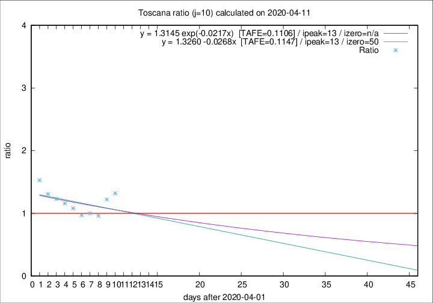

# Toscana

Data source: https://raw.githubusercontent.com/pcm-dpc/COVID-19/master/dati-json/dpc-covid19-ita-regioni.json

Delta days analysis (j): 10

Analyses for other values of j for 2020-04-11 are avalable [here](../2020-04-11/README.md)

Analyses for Toscana for previous dates are avalable [here](../README.md)

## Fitting 
|fit type|best fit equation|tafe|tfe|ipeak|izero|
|-------|-----|--------|------|---|---|
|linear|y = 1.3260 -0.0268x  [TAFE=0.1147]|0.1147|0.0169|13|50|
|exp|y = 1.3145 exp(-0.0217x)  [TAFE=0.1106]|0.1106|0.0085|13|n/a|

## Data
|Date|Daily deaths|Cumulated deaths|Deaths in the last 10 days|Deaths in the 10 days before|ratio|
|----|----------|-----------|-------|--------------------|-----|
|2020-04-11|13|467|214|162|1.3210|
|2020-04-10|46|454|210|172|1.2209|
|2020-04-09|16|408|177|184|0.9620|
|2020-04-08|23|392|177|177|1.0000|
|2020-04-07|19|369|171|176|0.9716|
|2020-04-06|25|350|173|160|1.0813|
|2020-04-05|18|325|167|144|1.1597|
|2020-04-04|17|307|165|134|1.2313|
|2020-04-03|22|290|161|123|1.3089|
|2020-04-02|15|268|159|104|1.5288|

[Download data as CSV](COVID-19_toscana_j10_2020-04-11.csv)

Generated April 16th, 2020 at 20:09:19 UTC+0200 with https://github.com/robianc/COVID-19
