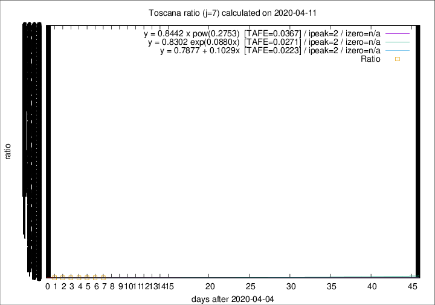

# Toscana

Data source: https://raw.githubusercontent.com/pcm-dpc/COVID-19/master/dati-json/dpc-covid19-ita-regioni.json

Estimates in this page were made on 16/4/2020 with data available until 11/04/2020.

## Summary 

### Peak estimate 
|j|linear [TAFE]|exponential [TAFE]|power law [TAFE]|details|
|---|----|-----------|---------|-------|
|7|7/4/2020 [TAFE=0.0223]|7/4/2020 [TAFE=0.0271]|7/4/2020 [TAFE=0.0367]|[analysis](COVID-19_toscana_j7_2020-04-11.md)|
|8|6/4/2020 [TAFE=0.0670]|6/4/2020 [TAFE=0.0621]|6/4/2020 [TAFE=0.0935]|[analysis](COVID-19_toscana_j8_2020-04-11.md)|
|9|5/4/2020 [TAFE=0.1252]|5/4/2020 [TAFE=0.1199]|5/4/2020 [TAFE=0.1305]|[analysis](COVID-19_toscana_j9_2020-04-11.md)|
|10|15/4/2020 [TAFE=0.1147]|15/4/2020 [TAFE=0.1106]|17/4/2020 [TAFE=0.0883]|[analysis](COVID-19_toscana_j10_2020-04-11.md)|
|11|11/4/2020 [TAFE=0.1334]|12/4/2020 [TAFE=0.1039]|13/4/2020 [TAFE=0.0469]|[analysis](COVID-19_toscana_j11_2020-04-11.md)|
|12|11/4/2020 [TAFE=0.3063]|12/4/2020 [TAFE=0.1622]|14/4/2020 [TAFE=0.0527]|[analysis](COVID-19_toscana_j12_2020-04-11.md)|
|13|10/4/2020 [TAFE=0.6220]|12/4/2020 [TAFE=0.2136]|15/4/2020 [TAFE=0.0959]|[analysis](COVID-19_toscana_j13_2020-04-11.md)|
|14|10/4/2020 [TAFE=0.8711]|12/4/2020 [TAFE=0.2228]|18/4/2020 [TAFE=0.1567]|[analysis](COVID-19_toscana_j14_2020-04-11.md)|

Best estimator is linear with j=7 (TAFE=0.0223)
Corresponding peak date estimate is 7/4/2020 (ipeak 2)

Peak date range estimate: 7/4/2020 - 25/4/2020

### End estimate 
|j|linear [TAFE/TFE]|exponential [TAFE/TFE]|power law [TAFE/TFE]|details|
|---|----|-----------|---------|-------|
|7|-|-|-|[analysis](COVID-19_toscana_j7_2020-04-11.md)|
|8|-|-|-|[analysis](COVID-19_toscana_j8_2020-04-11.md)|
|9|-|-|-|[analysis](COVID-19_toscana_j9_2020-04-11.md)|
|10|22/5/2020 [TAFE=0.1147]|-|-|[analysis](COVID-19_toscana_j10_2020-04-11.md)|
|11|-|-|-|[analysis](COVID-19_toscana_j11_2020-04-11.md)|
|12|-|-|-|[analysis](COVID-19_toscana_j12_2020-04-11.md)|
|13|-|-|-|[analysis](COVID-19_toscana_j13_2020-04-11.md)|
|14|-|-|-|[analysis](COVID-19_toscana_j14_2020-04-11.md)|

Best estimator is linear with j=10 (TAFE=0.1147)
Corresponding end date estimate is 22/5/2020 (izero 50)

End date range estimate: 2/4/2020 - 22/5/2020

Generated April 16th, 2020 at 20:09:19 UTC+0200 with https://github.com/robianc/COVID-19
