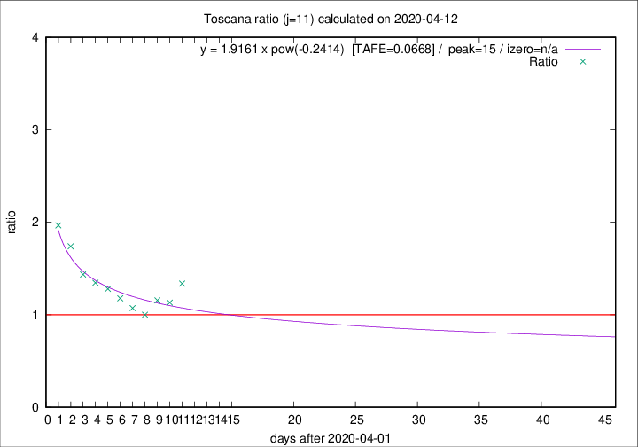

# Toscana

Data source: https://raw.githubusercontent.com/pcm-dpc/COVID-19/master/dati-json/dpc-covid19-ita-regioni.json

Delta days analysis (j): 11

Analyses for other values of j for 2020-04-12 are avalable [here](../README.md)

Analyses for Toscana for previous dates are avalable [here](../../README.md)

## Fitting 
|fit type|best fit equation|tafe|tfe|ipeak|izero|
|-------|-----|--------|------|---|---|
|pow|y = 1.9161 x pow(-0.2414)  [TAFE=0.0668]|0.0668|0.0042|15|n/a|

## Data
|Date|Daily deaths|Cumulated deaths|Deaths in the last 11 days|Deaths in the 11 days before|ratio|
|----|----------|-----------|-------|--------------------|-----|
|2020-04-12|28|495|242|181|1.3370|
|2020-04-11|13|467|223|197|1.1320|
|2020-04-10|46|454|223|193|1.1554|
|2020-04-09|16|408|193|193|1.0000|
|2020-04-08|23|392|194|181|1.0718|
|2020-04-07|19|369|192|163|1.1779|
|2020-04-06|25|350|192|150|1.2800|
|2020-04-05|18|325|183|136|1.3456|
|2020-04-04|17|307|178|124|1.4355|
|2020-04-03|22|290|181|104|1.7404|
|2020-04-02|15|268|177|90|1.9667|

[Download data as CSV](COVID-19_toscana_j11_2020-04-12.csv)

Generated April 12th, 2020 at 16:28:18 UTC+0200 with https://github.com/robianc/COVID-19
