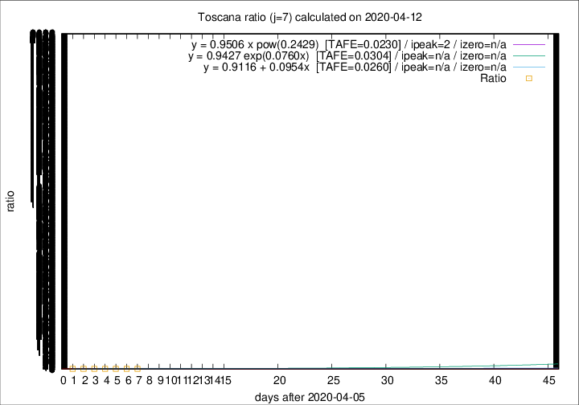

# Toscana

Data source: https://raw.githubusercontent.com/pcm-dpc/COVID-19/master/dati-json/dpc-covid19-ita-regioni.json

Delta days analysis (j): 7

Analyses for other values of j for 2020-04-12 are avalable [here](../2020-04-12/README.md)

Analyses for Toscana for previous dates are avalable [here](../README.md)

## Fitting 
|fit type|best fit equation|tafe|tfe|ipeak|izero|
|-------|-----|--------|------|---|---|
|linear|y = 0.9116 + 0.0954x  [TAFE=0.0260]|0.0260|0.0013|n/a|n/a|
|exp|y = 0.9427 exp(0.0760x)  [TAFE=0.0304]|0.0304|0.0005|n/a|n/a|
|pow|y = 0.9506 x pow(0.2429)  [TAFE=0.0230]|0.0230|0.0004|2|n/a|

## Data
|Date|Daily deaths|Cumulated deaths|Deaths in the last 7 days|Deaths in the 7 days before|ratio|
|----|----------|-----------|-------|--------------------|-----|
|2020-04-12|28|495|170|110|1.5455|
|2020-04-11|13|467|160|109|1.4679|
|2020-04-10|46|454|164|113|1.4513|
|2020-04-09|16|408|140|110|1.2727|
|2020-04-08|23|392|139|111|1.2523|
|2020-04-07|19|369|125|115|1.0870|
|2020-04-06|25|350|119|122|0.9754|

[Download data as CSV](COVID-19_toscana_j7_2020-04-12.csv)

Generated April 16th, 2020 at 20:09:19 UTC+0200 with https://github.com/robianc/COVID-19
