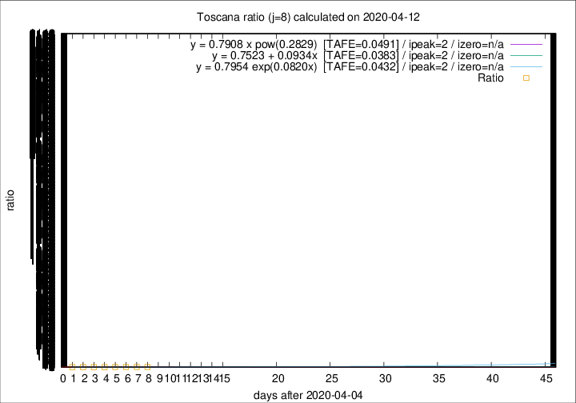

# Toscana

Data source: https://raw.githubusercontent.com/pcm-dpc/COVID-19/master/dati-json/dpc-covid19-ita-regioni.json

Delta days analysis (j): 8

Analyses for other values of j for 2020-04-12 are avalable [here](../2020-04-12/README.md)

Analyses for Toscana for previous dates are avalable [here](../README.md)

## Fitting 
|fit type|best fit equation|tafe|tfe|ipeak|izero|
|-------|-----|--------|------|---|---|
|linear|y = 0.7523 + 0.0934x  [TAFE=0.0383]|0.0383|0.0031|2|n/a|
|exp|y = 0.7954 exp(0.0820x)  [TAFE=0.0432]|0.0432|0.0014|2|n/a|
|pow|y = 0.7908 x pow(0.2829)  [TAFE=0.0491]|0.0491|0.0020|2|n/a|

## Data
|Date|Daily deaths|Cumulated deaths|Deaths in the last 8 days|Deaths in the 8 days before|ratio|
|----|----------|-----------|-------|--------------------|-----|
|2020-04-12|28|495|188|130|1.4462|
|2020-04-11|13|467|177|132|1.3409|
|2020-04-10|46|454|186|126|1.4762|
|2020-04-09|16|408|155|124|1.2500|
|2020-04-08|23|392|148|135|1.0963|
|2020-04-07|19|369|138|140|0.9857|
|2020-04-06|25|350|135|143|0.9441|
|2020-04-05|18|325|127|151|0.8411|

[Download data as CSV](COVID-19_toscana_j8_2020-04-12.csv)

Generated April 16th, 2020 at 20:09:19 UTC+0200 with https://github.com/robianc/COVID-19
