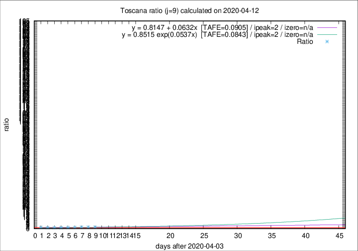

# Toscana

Data source: https://raw.githubusercontent.com/pcm-dpc/COVID-19/master/dati-json/dpc-covid19-ita-regioni.json

Delta days analysis (j): 9

Analyses for other values of j for 2020-04-12 are avalable [here](../2020-04-12/README.md)

Analyses for Toscana for previous dates are avalable [here](../README.md)

## Fitting 
|fit type|best fit equation|tafe|tfe|ipeak|izero|
|-------|-----|--------|------|---|---|
|linear|y = 0.8147 + 0.0632x  [TAFE=0.0905]|0.0905|0.0100|2|n/a|
|exp|y = 0.8515 exp(0.0537x)  [TAFE=0.0843]|0.0843|0.0048|2|n/a|

## Data
|Date|Daily deaths|Cumulated deaths|Deaths in the last 9 days|Deaths in the 9 days before|ratio|
|----|----------|-----------|-------|--------------------|-----|
|2020-04-12|28|495|205|148|1.3851|
|2020-04-11|13|467|199|139|1.4317|
|2020-04-10|46|454|201|144|1.3958|
|2020-04-09|16|408|164|153|1.0719|
|2020-04-08|23|392|161|159|1.0126|
|2020-04-07|19|369|154|168|0.9167|
|2020-04-06|25|350|152|160|0.9500|
|2020-04-05|18|325|148|155|0.9548|
|2020-04-04|17|307|149|141|1.0567|

[Download data as CSV](COVID-19_toscana_j9_2020-04-12.csv)

Generated April 12th, 2020 at 17:02:01 UTC+0200 with https://github.com/robianc/COVID-19
