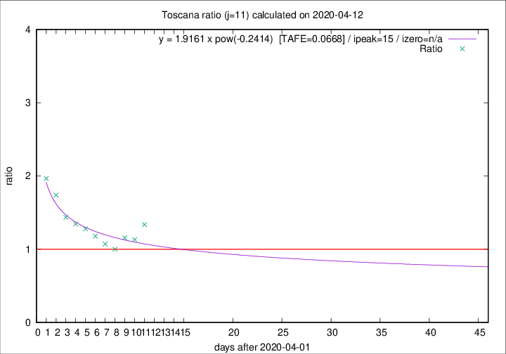

# Toscana

Data source: https://raw.githubusercontent.com/pcm-dpc/COVID-19/master/dati-json/dpc-covid19-ita-regioni.json

Estimates in this page were made on 14/4/2020 with data available until 12/04/2020.

## Summary 

### Peak estimate 
|j|linear [TAFE]|exponential [TAFE]|power law [TAFE]|details|
|---|----|-----------|---------|-------|
|7|-|-|8/4/2020 [TAFE=0.0230]|[analysis](COVID-19_toscana_j7_2020-04-12.md)|
|8|7/4/2020 [TAFE=0.0383]|7/4/2020 [TAFE=0.0432]|7/4/2020 [TAFE=0.0491]|[analysis](COVID-19_toscana_j8_2020-04-12.md)|
|9|6/4/2020 [TAFE=0.0905]|6/4/2020 [TAFE=0.0843]|6/4/2020 [TAFE=0.1236]|[analysis](COVID-19_toscana_j9_2020-04-12.md)|
|10|-|-|-|[analysis](COVID-19_toscana_j10_2020-04-12.md)|
|11|13/4/2020 [TAFE=0.1203]|14/4/2020 [TAFE=0.1074]|17/4/2020 [TAFE=0.0668]|[analysis](COVID-19_toscana_j11_2020-04-12.md)|
|12|12/4/2020 [TAFE=0.2262]|13/4/2020 [TAFE=0.1408]|15/4/2020 [TAFE=0.0456]|[analysis](COVID-19_toscana_j12_2020-04-12.md)|
|13|11/4/2020 [TAFE=0.4665]|13/4/2020 [TAFE=0.2058]|15/4/2020 [TAFE=0.0543]|[analysis](COVID-19_toscana_j13_2020-04-12.md)|
|14|11/4/2020 [TAFE=0.7098]|13/4/2020 [TAFE=0.2275]|18/4/2020 [TAFE=0.1402]|[analysis](COVID-19_toscana_j14_2020-04-12.md)|

Best estimator is pow with j=7 (TAFE=0.0230)
Corresponding peak date estimate is 8/4/2020 (ipeak 2)

Peak date range estimate: 6/4/2020 - 25/4/2020

### End estimate 
|j|linear [TAFE/TFE]|exponential [TAFE/TFE]|power law [TAFE/TFE]|details|
|---|----|-----------|---------|-------|
|7|-|-|-|[analysis](COVID-19_toscana_j7_2020-04-12.md)|
|8|-|-|-|[analysis](COVID-19_toscana_j8_2020-04-12.md)|
|9|-|-|-|[analysis](COVID-19_toscana_j9_2020-04-12.md)|
|10|-|-|-|[analysis](COVID-19_toscana_j10_2020-04-12.md)|
|11|28/4/2020 [TAFE=0.1203]|-|-|[analysis](COVID-19_toscana_j11_2020-04-12.md)|
|12|-|-|-|[analysis](COVID-19_toscana_j12_2020-04-12.md)|
|13|-|-|-|[analysis](COVID-19_toscana_j13_2020-04-12.md)|
|14|-|-|-|[analysis](COVID-19_toscana_j14_2020-04-12.md)|

Best estimator is linear with j=11 (TAFE=0.1203)
Corresponding end date estimate is 28/4/2020 (izero 26)

End date range estimate: 2/4/2020 - 28/4/2020

Generated April 14th, 2020 at 19:16:04 UTC+0200 with https://github.com/robianc/COVID-19
