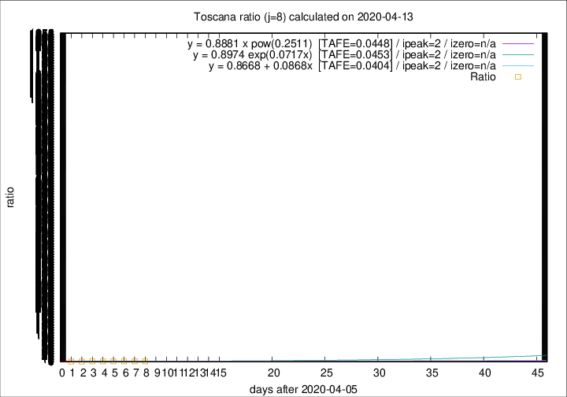

# Toscana

Data source: https://raw.githubusercontent.com/pcm-dpc/COVID-19/master/dati-json/dpc-covid19-ita-regioni.json

Estimates in this page were made on 16/4/2020 with data available until 13/04/2020.

## Summary 

### Peak estimate 
|j|linear [TAFE]|exponential [TAFE]|power law [TAFE]|details|
|---|----|-----------|---------|-------|
|7|-|-|-|[analysis](COVID-19_toscana_j7_2020-04-13.md)|
|8|8/4/2020 [TAFE=0.0404]|8/4/2020 [TAFE=0.0453]|8/4/2020 [TAFE=0.0448]|[analysis](COVID-19_toscana_j8_2020-04-13.md)|
|9|7/4/2020 [TAFE=0.0688]|7/4/2020 [TAFE=0.0650]|7/4/2020 [TAFE=0.0925]|[analysis](COVID-19_toscana_j9_2020-04-13.md)|
|10|-|-|-|[analysis](COVID-19_toscana_j10_2020-04-13.md)|
|11|19/4/2020 [TAFE=0.1151]|21/4/2020 [TAFE=0.1101]|1/5/2020 [TAFE=0.0859]|[analysis](COVID-19_toscana_j11_2020-04-13.md)|
|12|14/4/2020 [TAFE=0.1385]|15/4/2020 [TAFE=0.1105]|18/4/2020 [TAFE=0.0481]|[analysis](COVID-19_toscana_j12_2020-04-13.md)|
|13|13/4/2020 [TAFE=0.3047]|14/4/2020 [TAFE=0.1628]|17/4/2020 [TAFE=0.0525]|[analysis](COVID-19_toscana_j13_2020-04-13.md)|
|14|12/4/2020 [TAFE=0.6356]|14/4/2020 [TAFE=0.2232]|18/4/2020 [TAFE=0.0942]|[analysis](COVID-19_toscana_j14_2020-04-13.md)|

Best estimator is linear with j=8 (TAFE=0.0404)
Corresponding peak date estimate is 8/4/2020 (ipeak 2)

Peak date range estimate: 6/4/2020 - 4/5/2020

### End estimate 
|j|linear [TAFE/TFE]|exponential [TAFE/TFE]|power law [TAFE/TFE]|details|
|---|----|-----------|---------|-------|
|7|-|-|-|[analysis](COVID-19_toscana_j7_2020-04-13.md)|
|8|-|-|-|[analysis](COVID-19_toscana_j8_2020-04-13.md)|
|9|-|-|-|[analysis](COVID-19_toscana_j9_2020-04-13.md)|
|10|-|-|-|[analysis](COVID-19_toscana_j10_2020-04-13.md)|
|11|25/5/2020 [TAFE=0.1151]|-|-|[analysis](COVID-19_toscana_j11_2020-04-13.md)|
|12|-|-|-|[analysis](COVID-19_toscana_j12_2020-04-13.md)|
|13|-|-|-|[analysis](COVID-19_toscana_j13_2020-04-13.md)|
|14|-|-|-|[analysis](COVID-19_toscana_j14_2020-04-13.md)|

Best estimator is linear with j=11 (TAFE=0.1151)
Corresponding end date estimate is 25/5/2020 (izero 52)

End date range estimate: 3/4/2020 - 25/5/2020

Generated April 16th, 2020 at 20:09:19 UTC+0200 with https://github.com/robianc/COVID-19
