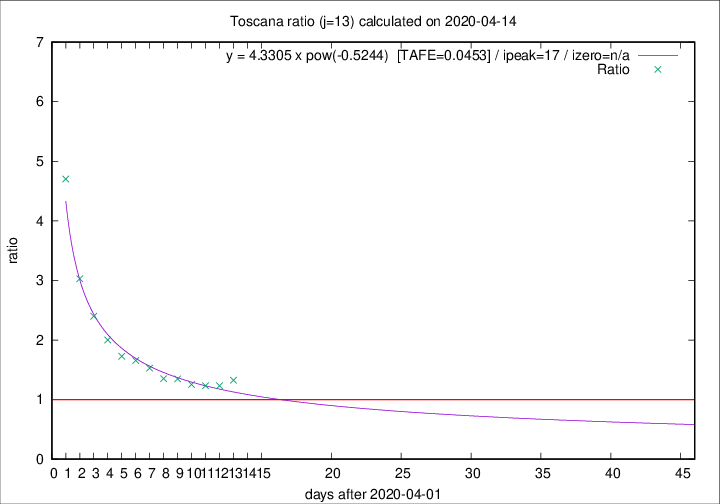
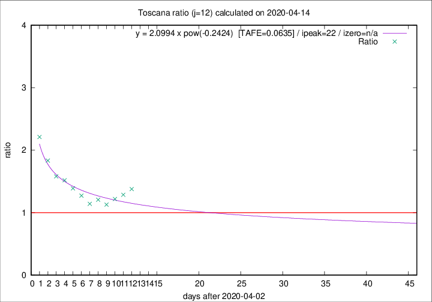

# Toscana

Data source: https://raw.githubusercontent.com/pcm-dpc/COVID-19/master/dati-json/dpc-covid19-ita-regioni.json

Estimates in this page were made on 16/4/2020 with data available until 14/04/2020.

## Summary 

### Peak estimate 
|j|linear [TAFE]|exponential [TAFE]|power law [TAFE]|details|
|---|----|-----------|---------|-------|
|7|-|-|-|[analysis](COVID-19_toscana_j7_2020-04-14.md)|
|8|-|-|-|[analysis](COVID-19_toscana_j8_2020-04-14.md)|
|9|8/4/2020 [TAFE=0.0619]|8/4/2020 [TAFE=0.0632]|8/4/2020 [TAFE=0.0687]|[analysis](COVID-19_toscana_j9_2020-04-14.md)|
|10|7/4/2020 [TAFE=0.0819]|7/4/2020 [TAFE=0.0814]|7/4/2020 [TAFE=0.1059]|[analysis](COVID-19_toscana_j10_2020-04-14.md)|
|11|-|-|-|[analysis](COVID-19_toscana_j11_2020-04-14.md)|
|12|16/4/2020 [TAFE=0.1181]|18/4/2020 [TAFE=0.1038]|25/4/2020 [TAFE=0.0635]|[analysis](COVID-19_toscana_j12_2020-04-14.md)|
|13|14/4/2020 [TAFE=0.2241]|16/4/2020 [TAFE=0.1412]|19/4/2020 [TAFE=0.0453]|[analysis](COVID-19_toscana_j13_2020-04-14.md)|
|14|13/4/2020 [TAFE=0.4650]|15/4/2020 [TAFE=0.2067]|18/4/2020 [TAFE=0.0583]|[analysis](COVID-19_toscana_j14_2020-04-14.md)|

Best estimator is pow with j=13 (TAFE=0.0453)
Corresponding peak date estimate is 19/4/2020 (ipeak 17)

Peak date range estimate: 2/4/2020 - 24/4/2020

### End estimate 
|j|linear [TAFE/TFE]|exponential [TAFE/TFE]|power law [TAFE/TFE]|details|
|---|----|-----------|---------|-------|
|7|-|-|-|[analysis](COVID-19_toscana_j7_2020-04-14.md)|
|8|-|-|-|[analysis](COVID-19_toscana_j8_2020-04-14.md)|
|9|-|-|-|[analysis](COVID-19_toscana_j9_2020-04-14.md)|
|10|-|-|-|[analysis](COVID-19_toscana_j10_2020-04-14.md)|
|11|-|-|-|[analysis](COVID-19_toscana_j11_2020-04-14.md)|
|12|1/5/2020 [TAFE=0.1181]|-|-|[analysis](COVID-19_toscana_j12_2020-04-14.md)|
|13|-|-|-|[analysis](COVID-19_toscana_j13_2020-04-14.md)|
|14|-|-|-|[analysis](COVID-19_toscana_j14_2020-04-14.md)|

Best estimator is linear with j=12 (TAFE=0.1181)
Corresponding end date estimate is 1/5/2020 (izero 28)

End date range estimate: 3/4/2020 - 1/5/2020

Generated April 16th, 2020 at 20:09:19 UTC+0200 with https://github.com/robianc/COVID-19
