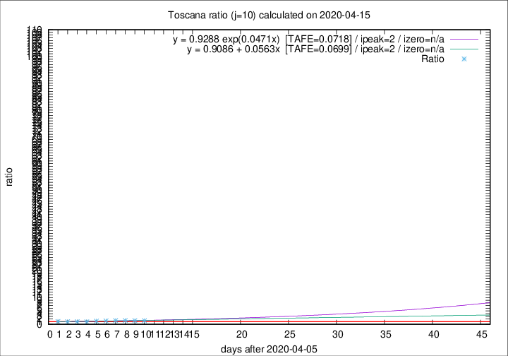

# Toscana

Data source: https://raw.githubusercontent.com/pcm-dpc/COVID-19/master/dati-json/dpc-covid19-ita-regioni.json

Delta days analysis (j): 10

Analyses for other values of j for 2020-04-15 are avalable [here](../2020-04-15/README.md)

Analyses for Toscana for previous dates are avalable [here](../README.md)

## Fitting 
|fit type|best fit equation|tafe|tfe|ipeak|izero|
|-------|-----|--------|------|---|---|
|linear|y = 0.9086 + 0.0563x  [TAFE=0.0699]|0.0699|0.0065|2|n/a|
|exp|y = 0.9288 exp(0.0471x)  [TAFE=0.0718]|0.0718|0.0031|2|n/a|

## Data
|Date|Daily deaths|Cumulated deaths|Deaths in the last 10 days|Deaths in the 10 days before|ratio|
|----|----------|-----------|-------|--------------------|-----|
|2020-04-15|18|556|231|167|1.3832|
|2020-04-14|20|538|231|165|1.4000|
|2020-04-13|23|518|228|161|1.4161|
|2020-04-12|28|495|227|159|1.4277|
|2020-04-11|13|467|214|162|1.3210|
|2020-04-10|46|454|210|172|1.2209|
|2020-04-09|16|408|177|184|0.9620|
|2020-04-08|23|392|177|177|1.0000|
|2020-04-07|19|369|171|176|0.9716|
|2020-04-06|25|350|173|160|1.0813|

[Download data as CSV](COVID-19_toscana_j10_2020-04-15.csv)

Generated April 16th, 2020 at 20:09:19 UTC+0200 with https://github.com/robianc/COVID-19
