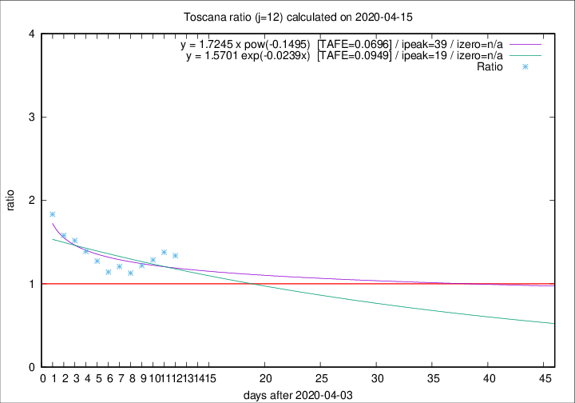

# Toscana

Data source: https://raw.githubusercontent.com/pcm-dpc/COVID-19/master/dati-json/dpc-covid19-ita-regioni.json

Delta days analysis (j): 12

Analyses for other values of j for 2020-04-15 are avalable [here](../2020-04-15/README.md)

Analyses for Toscana for previous dates are avalable [here](../README.md)

## Fitting 
|fit type|best fit equation|tafe|tfe|ipeak|izero|
|-------|-----|--------|------|---|---|
|exp|y = 1.5701 exp(-0.0239x)  [TAFE=0.0949]|0.0949|0.0057|19|n/a|
|pow|y = 1.7245 x pow(-0.1495)  [TAFE=0.0696]|0.0696|0.0034|39|n/a|

## Data
|Date|Daily deaths|Cumulated deaths|Deaths in the last 12 days|Deaths in the 12 days before|ratio|
|----|----------|-----------|-------|--------------------|-----|
|2020-04-15|18|556|266|199|1.3367|
|2020-04-14|20|538|270|196|1.3776|
|2020-04-13|23|518|265|206|1.2864|
|2020-04-12|28|495|251|206|1.2184|
|2020-04-11|13|467|236|209|1.1292|
|2020-04-10|46|454|239|198|1.2071|
|2020-04-09|16|408|210|184|1.1413|
|2020-04-08|23|392|215|169|1.2722|
|2020-04-07|19|369|211|152|1.3882|
|2020-04-06|25|350|208|137|1.5182|
|2020-04-05|18|325|196|124|1.5806|
|2020-04-04|17|307|198|108|1.8333|

[Download data as CSV](COVID-19_toscana_j12_2020-04-15.csv)

Generated April 19th, 2020 at 18:42:39 UTC+0200 with https://github.com/robianc/COVID-19
