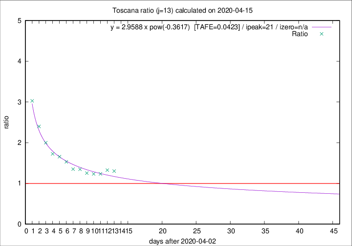

# Toscana

Data source: https://raw.githubusercontent.com/pcm-dpc/COVID-19/master/dati-json/dpc-covid19-ita-regioni.json

Delta days analysis (j): 13

Analyses for other values of j for 2020-04-15 are avalable [here](../2020-04-15/README.md)

Analyses for Toscana for previous dates are avalable [here](../README.md)

## Fitting 
|fit type|best fit equation|tafe|tfe|ipeak|izero|
|-------|-----|--------|------|---|---|
|pow|y = 2.9588 x pow(-0.3617)  [TAFE=0.0423]|0.0423|0.0015|21|n/a|

## Data
|Date|Daily deaths|Cumulated deaths|Deaths in the last 13 days|Deaths in the 13 days before|ratio|
|----|----------|-----------|-------|--------------------|-----|
|2020-04-15|18|556|288|221|1.3032|
|2020-04-14|20|538|285|215|1.3256|
|2020-04-13|23|518|274|222|1.2342|
|2020-04-12|28|495|264|214|1.2336|
|2020-04-11|13|467|252|201|1.2537|
|2020-04-10|46|454|256|190|1.3474|
|2020-04-09|16|408|231|171|1.3509|
|2020-04-08|23|392|234|153|1.5294|
|2020-04-07|19|369|227|137|1.6569|
|2020-04-06|25|350|221|128|1.7266|
|2020-04-05|18|325|216|108|2.0000|
|2020-04-04|17|307|216|90|2.4000|
|2020-04-03|22|290|218|72|3.0278|

[Download data as CSV](COVID-19_toscana_j13_2020-04-15.csv)

Generated April 16th, 2020 at 20:09:19 UTC+0200 with https://github.com/robianc/COVID-19
