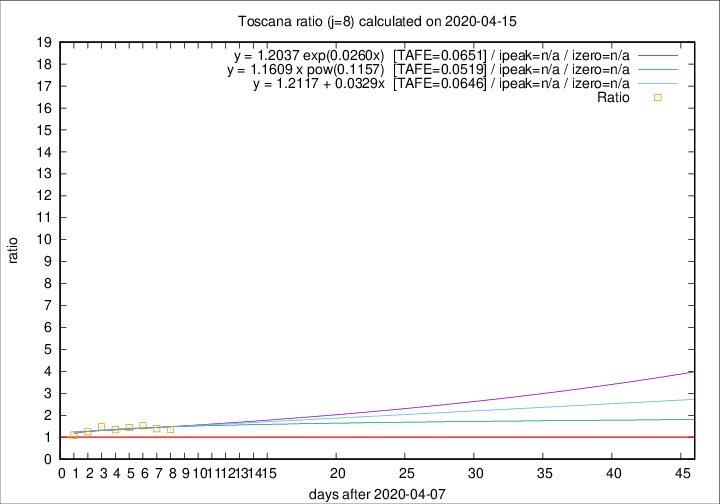

# Toscana

Data source: https://raw.githubusercontent.com/pcm-dpc/COVID-19/master/dati-json/dpc-covid19-ita-regioni.json

Delta days analysis (j): 8

Analyses for other values of j for 2020-04-15 are avalable [here](../2020-04-15/README.md)

Analyses for Toscana for previous dates are avalable [here](../README.md)

## Fitting 
|fit type|best fit equation|tafe|tfe|ipeak|izero|
|-------|-----|--------|------|---|---|
|linear|y = 1.2117 + 0.0329x  [TAFE=0.0646]|0.0646|0.0062|n/a|n/a|
|exp|y = 1.2037 exp(0.0260x)  [TAFE=0.0651]|0.0651|0.0029|n/a|n/a|
|pow|y = 1.1609 x pow(0.1157)  [TAFE=0.0519]|0.0519|0.0019|n/a|n/a|

## Data
|Date|Daily deaths|Cumulated deaths|Deaths in the last 8 days|Deaths in the 8 days before|ratio|
|----|----------|-----------|-------|--------------------|-----|
|2020-04-15|18|556|187|138|1.3551|
|2020-04-14|20|538|188|135|1.3926|
|2020-04-13|23|518|193|127|1.5197|
|2020-04-12|28|495|188|130|1.4462|
|2020-04-11|13|467|177|132|1.3409|
|2020-04-10|46|454|186|126|1.4762|
|2020-04-09|16|408|155|124|1.2500|
|2020-04-08|23|392|148|135|1.0963|

[Download data as CSV](COVID-19_toscana_j8_2020-04-15.csv)

Generated April 16th, 2020 at 20:09:19 UTC+0200 with https://github.com/robianc/COVID-19
