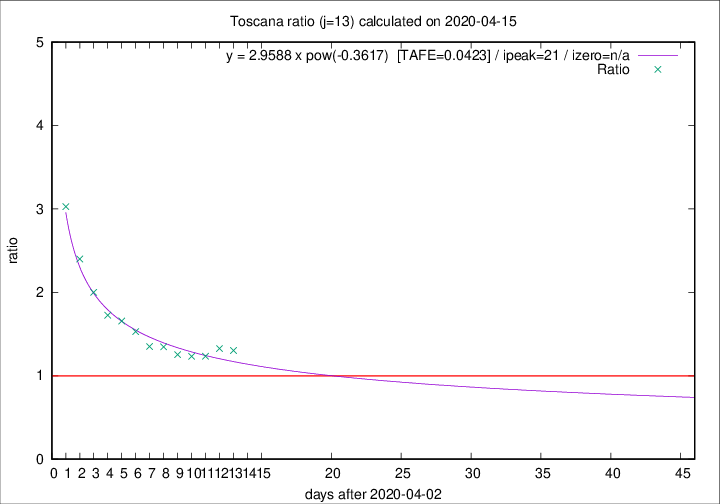

# Toscana

Data source: https://raw.githubusercontent.com/pcm-dpc/COVID-19/master/dati-json/dpc-covid19-ita-regioni.json

Estimates in this page were made on 16/4/2020 with data available until 15/04/2020.

## Summary 

### Peak estimate 
|j|linear [TAFE]|exponential [TAFE]|power law [TAFE]|details|
|---|----|-----------|---------|-------|
|7|4/5/2020 [TAFE=0.0664]|5/5/2020 [TAFE=0.0679]|-|[analysis](COVID-19_toscana_j7_2020-04-15.md)|
|8|-|-|-|[analysis](COVID-19_toscana_j8_2020-04-15.md)|
|9|-|-|9/4/2020 [TAFE=0.0524]|[analysis](COVID-19_toscana_j9_2020-04-15.md)|
|10|8/4/2020 [TAFE=0.0699]|8/4/2020 [TAFE=0.0718]|8/4/2020 [TAFE=0.0790]|[analysis](COVID-19_toscana_j10_2020-04-15.md)|
|11|-|-|-|[analysis](COVID-19_toscana_j11_2020-04-15.md)|
|12|21/4/2020 [TAFE=0.0984]|23/4/2020 [TAFE=0.0949]|13/5/2020 [TAFE=0.0696]|[analysis](COVID-19_toscana_j12_2020-04-15.md)|
|13|16/4/2020 [TAFE=0.1417]|18/4/2020 [TAFE=0.1073]|24/4/2020 [TAFE=0.0423]|[analysis](COVID-19_toscana_j13_2020-04-15.md)|
|14|15/4/2020 [TAFE=0.3093]|16/4/2020 [TAFE=0.1662]|21/4/2020 [TAFE=0.0564]|[analysis](COVID-19_toscana_j14_2020-04-15.md)|

Best estimator is pow with j=13 (TAFE=0.0423)
Corresponding peak date estimate is 24/4/2020 (ipeak 21)

Peak date range estimate: 3/4/2020 - 12/5/2020

### End estimate 
|j|linear [TAFE/TFE]|exponential [TAFE/TFE]|power law [TAFE/TFE]|details|
|---|----|-----------|---------|-------|
|7|25/6/2020 [TAFE=0.0664]|-|-|[analysis](COVID-19_toscana_j7_2020-04-15.md)|
|8|-|-|-|[analysis](COVID-19_toscana_j8_2020-04-15.md)|
|9|-|-|-|[analysis](COVID-19_toscana_j9_2020-04-15.md)|
|10|-|-|-|[analysis](COVID-19_toscana_j10_2020-04-15.md)|
|11|-|-|-|[analysis](COVID-19_toscana_j11_2020-04-15.md)|
|12|-|-|-|[analysis](COVID-19_toscana_j12_2020-04-15.md)|
|13|-|-|-|[analysis](COVID-19_toscana_j13_2020-04-15.md)|
|14|-|-|-|[analysis](COVID-19_toscana_j14_2020-04-15.md)|

Best estimator is linear with j=7 (TAFE=0.0664)
Corresponding end date estimate is 25/6/2020 (izero 77)

End date range estimate: 9/4/2020 - 25/6/2020

Generated April 16th, 2020 at 20:09:19 UTC+0200 with https://github.com/robianc/COVID-19
