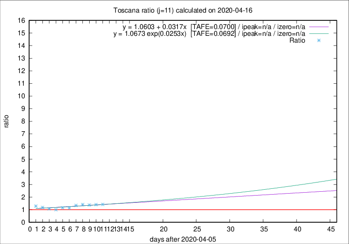

# Toscana

Data source: https://raw.githubusercontent.com/pcm-dpc/COVID-19/master/dati-json/dpc-covid19-ita-regioni.json

Delta days analysis (j): 11

Analyses for other values of j for 2020-04-16 are avalable [here](../2020-04-16/README.md)

Analyses for Toscana for previous dates are avalable [here](../README.md)

## Fitting 
|fit type|best fit equation|tafe|tfe|ipeak|izero|
|-------|-----|--------|------|---|---|
|linear|y = 1.0603 + 0.0317x  [TAFE=0.0700]|0.0700|0.0072|n/a|n/a|
|exp|y = 1.0673 exp(0.0253x)  [TAFE=0.0692]|0.0692|0.0037|n/a|n/a|

## Data
|Date|Daily deaths|Cumulated deaths|Deaths in the last 11 days|Deaths in the 11 days before|ratio|
|----|----------|-----------|-------|--------------------|-----|
|2020-04-16|29|585|260|183|1.4208|
|2020-04-15|18|556|249|178|1.3989|
|2020-04-14|20|538|248|181|1.3702|
|2020-04-13|23|518|250|177|1.4124|
|2020-04-12|28|495|242|181|1.3370|
|2020-04-11|13|467|223|197|1.1320|
|2020-04-10|46|454|223|193|1.1554|
|2020-04-09|16|408|193|193|1.0000|
|2020-04-08|23|392|194|181|1.0718|
|2020-04-07|19|369|192|163|1.1779|
|2020-04-06|25|350|192|150|1.2800|

[Download data as CSV](COVID-19_toscana_j11_2020-04-16.csv)

Generated April 16th, 2020 at 20:09:19 UTC+0200 with https://github.com/robianc/COVID-19
