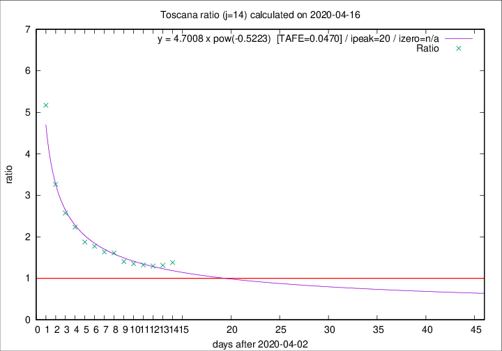

# Toscana

Data source: https://raw.githubusercontent.com/pcm-dpc/COVID-19/master/dati-json/dpc-covid19-ita-regioni.json

Delta days analysis (j): 14

Analyses for other values of j for 2020-04-16 are avalable [here](../2020-04-16/README.md)

Analyses for Toscana for previous dates are avalable [here](../README.md)

## Fitting 
|fit type|best fit equation|tafe|tfe|ipeak|izero|
|-------|-----|--------|------|---|---|
|pow|y = 4.7008 x pow(-0.5223)  [TAFE=0.0470]|0.0470|0.0018|20|n/a|

## Data
|Date|Daily deaths|Cumulated deaths|Deaths in the last 14 days|Deaths in the 14 days before|ratio|
|----|----------|-----------|-------|--------------------|-----|
|2020-04-16|29|585|317|230|1.3783|
|2020-04-15|18|556|303|231|1.3117|
|2020-04-14|20|538|294|227|1.2952|
|2020-04-13|23|518|287|217|1.3226|
|2020-04-12|28|495|280|207|1.3527|
|2020-04-11|13|467|269|192|1.4010|
|2020-04-10|46|454|277|172|1.6105|
|2020-04-09|16|408|250|153|1.6340|
|2020-04-08|23|392|250|141|1.7730|
|2020-04-07|19|369|240|128|1.8750|
|2020-04-06|25|350|241|108|2.2315|
|2020-04-05|18|325|234|91|2.5714|
|2020-04-04|17|307|235|72|3.2639|
|2020-04-03|22|290|243|47|5.1702|

[Download data as CSV](COVID-19_toscana_j14_2020-04-16.csv)

Generated April 16th, 2020 at 20:09:19 UTC+0200 with https://github.com/robianc/COVID-19
