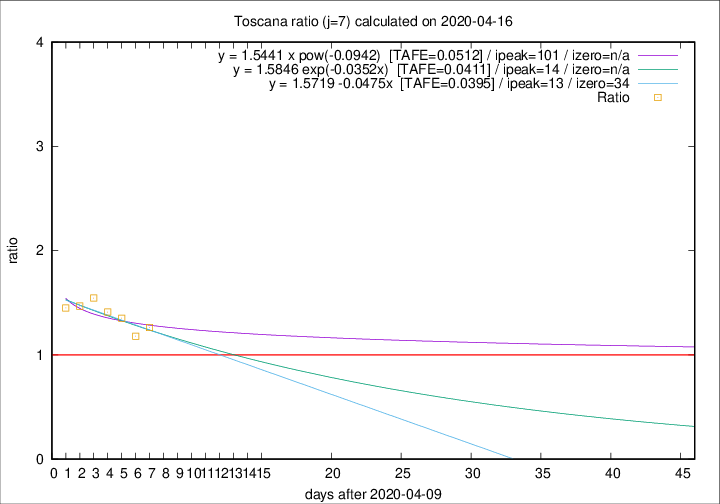

# Toscana

Data source: https://raw.githubusercontent.com/pcm-dpc/COVID-19/master/dati-json/dpc-covid19-ita-regioni.json

Estimates in this page were made on 16/4/2020 with data available until 16/04/2020.

## Summary 

### Peak estimate 
|j|linear [TAFE]|exponential [TAFE]|power law [TAFE]|details|
|---|----|-----------|---------|-------|
|7|23/4/2020 [TAFE=0.0395]|24/4/2020 [TAFE=0.0411]|20/7/2020 [TAFE=0.0512]|[analysis](COVID-19_toscana_j7_2020-04-16.md)|
|8|-|-|-|[analysis](COVID-19_toscana_j8_2020-04-16.md)|
|9|-|-|-|[analysis](COVID-19_toscana_j9_2020-04-16.md)|
|10|-|-|9/4/2020 [TAFE=0.0590]|[analysis](COVID-19_toscana_j10_2020-04-16.md)|
|11|-|-|-|[analysis](COVID-19_toscana_j11_2020-04-16.md)|
|12|9/5/2020 [TAFE=0.0864]|16/5/2020 [TAFE=0.0856]|-|[analysis](COVID-19_toscana_j12_2020-04-16.md)|
|13|19/4/2020 [TAFE=0.1108]|20/4/2020 [TAFE=0.0940]|1/5/2020 [TAFE=0.0498]|[analysis](COVID-19_toscana_j13_2020-04-16.md)|
|14|16/4/2020 [TAFE=0.2286]|18/4/2020 [TAFE=0.1416]|23/4/2020 [TAFE=0.0470]|[analysis](COVID-19_toscana_j14_2020-04-16.md)|

Best estimator is linear with j=7 (TAFE=0.0395)
Corresponding peak date estimate is 23/4/2020 (ipeak 13)

Peak date range estimate: 10/4/2020 - 20/7/2020

### End estimate 
|j|linear [TAFE/TFE]|exponential [TAFE/TFE]|power law [TAFE/TFE]|details|
|---|----|-----------|---------|-------|
|7|14/5/2020 [TAFE=0.0395]|-|-|[analysis](COVID-19_toscana_j7_2020-04-16.md)|
|8|-|-|-|[analysis](COVID-19_toscana_j8_2020-04-16.md)|
|9|-|-|-|[analysis](COVID-19_toscana_j9_2020-04-16.md)|
|10|-|-|-|[analysis](COVID-19_toscana_j10_2020-04-16.md)|
|11|-|-|-|[analysis](COVID-19_toscana_j11_2020-04-16.md)|
|12|-|-|-|[analysis](COVID-19_toscana_j12_2020-04-16.md)|
|13|-|-|-|[analysis](COVID-19_toscana_j13_2020-04-16.md)|
|14|-|-|-|[analysis](COVID-19_toscana_j14_2020-04-16.md)|

Best estimator is linear with j=7 (TAFE=0.0395)
Corresponding end date estimate is 14/5/2020 (izero 34)

End date range estimate: 10/4/2020 - 14/5/2020

Generated April 16th, 2020 at 20:09:19 UTC+0200 with https://github.com/robianc/COVID-19
