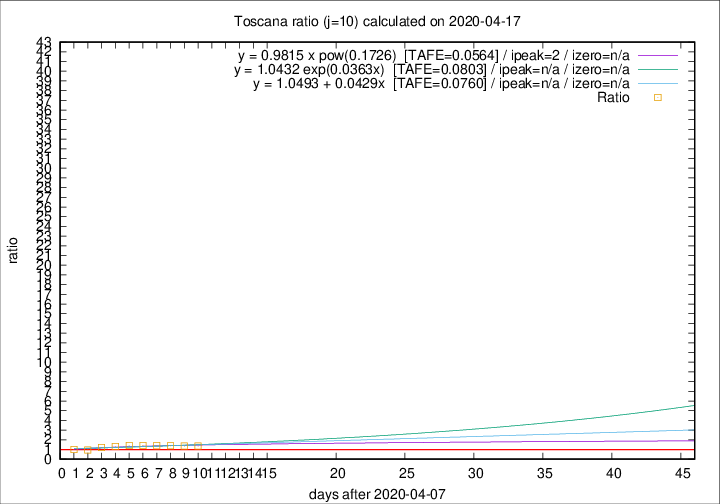

# Toscana

Data source: https://raw.githubusercontent.com/pcm-dpc/COVID-19/master/dati-json/dpc-covid19-ita-regioni.json

Delta days analysis (j): 10

Analyses for other values of j for 2020-04-17 are avalable [here](../2020-04-17/README.md)

Analyses for Toscana for previous dates are avalable [here](../README.md)

## Fitting 
|fit type|best fit equation|tafe|tfe|ipeak|izero|
|-------|-----|--------|------|---|---|
|linear|y = 1.0493 + 0.0429x  [TAFE=0.0760]|0.0760|0.0082|n/a|n/a|
|exp|y = 1.0432 exp(0.0363x)  [TAFE=0.0803]|0.0803|0.0040|n/a|n/a|
|pow|y = 0.9815 x pow(0.1726)  [TAFE=0.0564]|0.0564|0.0023|2|n/a|

## Data
|Date|Daily deaths|Cumulated deaths|Deaths in the last 10 days|Deaths in the 10 days before|ratio|
|----|----------|-----------|-------|--------------------|-----|
|2020-04-17|17|602|233|171|1.3626|
|2020-04-16|29|585|235|173|1.3584|
|2020-04-15|18|556|231|167|1.3832|
|2020-04-14|20|538|231|165|1.4000|
|2020-04-13|23|518|228|161|1.4161|
|2020-04-12|28|495|227|159|1.4277|
|2020-04-11|13|467|214|162|1.3210|
|2020-04-10|46|454|210|172|1.2209|
|2020-04-09|16|408|177|184|0.9620|
|2020-04-08|23|392|177|177|1.0000|

[Download data as CSV](COVID-19_toscana_j10_2020-04-17.csv)

Generated April 19th, 2020 at 18:42:39 UTC+0200 with https://github.com/robianc/COVID-19
