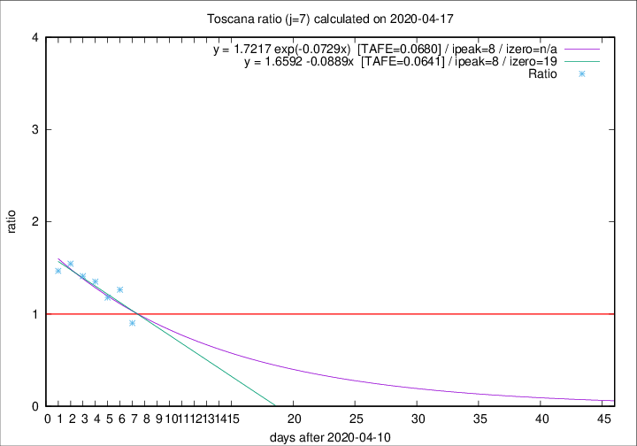

# Toscana

Data source: https://raw.githubusercontent.com/pcm-dpc/COVID-19/master/dati-json/dpc-covid19-ita-regioni.json

Delta days analysis (j): 7

Analyses for other values of j for 2020-04-17 are avalable [here](../2020-04-17/README.md)

Analyses for Toscana for previous dates are avalable [here](../README.md)

## Fitting 
|fit type|best fit equation|tafe|tfe|ipeak|izero|
|-------|-----|--------|------|---|---|
|linear|y = 1.6592 -0.0889x  [TAFE=0.0641]|0.0641|0.0068|8|19|
|exp|y = 1.7217 exp(-0.0729x)  [TAFE=0.0680]|0.0680|0.0033|8|n/a|

## Data
|Date|Daily deaths|Cumulated deaths|Deaths in the last 7 days|Deaths in the 7 days before|ratio|
|----|----------|-----------|-------|--------------------|-----|
|2020-04-17|17|602|148|164|0.9024|
|2020-04-16|29|585|177|140|1.2643|
|2020-04-15|18|556|164|139|1.1799|
|2020-04-14|20|538|169|125|1.3520|
|2020-04-13|23|518|168|119|1.4118|
|2020-04-12|28|495|170|110|1.5455|
|2020-04-11|13|467|160|109|1.4679|

[Download data as CSV](COVID-19_toscana_j7_2020-04-17.csv)

Generated April 19th, 2020 at 18:42:39 UTC+0200 with https://github.com/robianc/COVID-19
