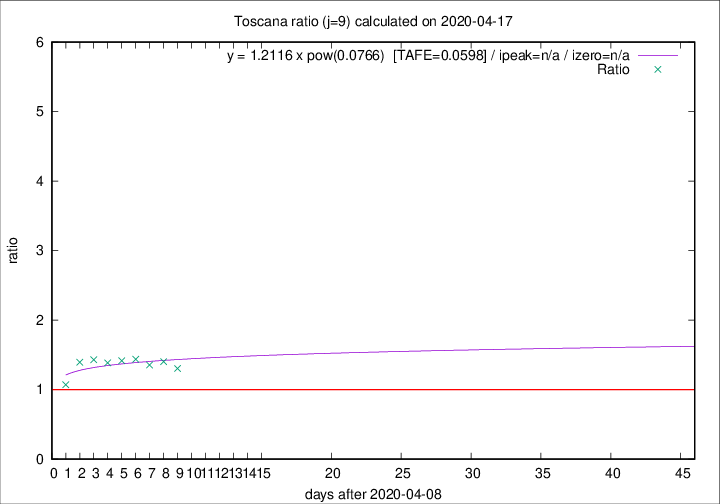

# Toscana

Data source: https://raw.githubusercontent.com/pcm-dpc/COVID-19/master/dati-json/dpc-covid19-ita-regioni.json

Delta days analysis (j): 9

Analyses for other values of j for 2020-04-17 are avalable [here](../2020-04-17/README.md)

Analyses for Toscana for previous dates are avalable [here](../README.md)

## Fitting 
|fit type|best fit equation|tafe|tfe|ipeak|izero|
|-------|-----|--------|------|---|---|
|pow|y = 1.2116 x pow(0.0766)  [TAFE=0.0598]|0.0598|0.0025|n/a|n/a|

## Data
|Date|Daily deaths|Cumulated deaths|Deaths in the last 9 days|Deaths in the 9 days before|ratio|
|----|----------|-----------|-------|--------------------|-----|
|2020-04-17|17|602|210|161|1.3043|
|2020-04-16|29|585|216|154|1.4026|
|2020-04-15|18|556|206|152|1.3553|
|2020-04-14|20|538|213|148|1.4392|
|2020-04-13|23|518|211|149|1.4161|
|2020-04-12|28|495|205|148|1.3851|
|2020-04-11|13|467|199|139|1.4317|
|2020-04-10|46|454|201|144|1.3958|
|2020-04-09|16|408|164|153|1.0719|

[Download data as CSV](COVID-19_toscana_j9_2020-04-17.csv)

Generated April 19th, 2020 at 18:42:39 UTC+0200 with https://github.com/robianc/COVID-19
