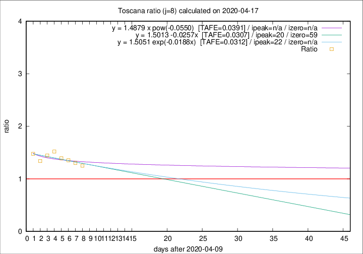

# Toscana

Data source: https://raw.githubusercontent.com/pcm-dpc/COVID-19/master/dati-json/dpc-covid19-ita-regioni.json

Estimates in this page were made on 19/4/2020 with data available until 17/04/2020.

## Summary 

### Peak estimate 
|j|linear [TAFE]|exponential [TAFE]|power law [TAFE]|details|
|---|----|-----------|---------|-------|
|7|19/4/2020 [TAFE=0.0641]|19/4/2020 [TAFE=0.0680]|23/4/2020 [TAFE=0.0962]|[analysis](COVID-19_toscana_j7_2020-04-17.md)|
|8|30/4/2020 [TAFE=0.0307]|2/5/2020 [TAFE=0.0312]|-|[analysis](COVID-19_toscana_j8_2020-04-17.md)|
|9|-|-|-|[analysis](COVID-19_toscana_j9_2020-04-17.md)|
|10|-|-|10/4/2020 [TAFE=0.0564]|[analysis](COVID-19_toscana_j10_2020-04-17.md)|
|11|-|-|-|[analysis](COVID-19_toscana_j11_2020-04-17.md)|
|12|-|-|-|[analysis](COVID-19_toscana_j12_2020-04-17.md)|
|13|22/4/2020 [TAFE=0.0869]|25/4/2020 [TAFE=0.0810]|18/5/2020 [TAFE=0.0539]|[analysis](COVID-19_toscana_j13_2020-04-17.md)|
|14|18/4/2020 [TAFE=0.1366]|20/4/2020 [TAFE=0.1015]|28/4/2020 [TAFE=0.0365]|[analysis](COVID-19_toscana_j14_2020-04-17.md)|

Best estimator is linear with j=8 (TAFE=0.0307)
Corresponding peak date estimate is 30/4/2020 (ipeak 20)

Peak date range estimate: 10/4/2020 - 23/5/2020

### End estimate 
|j|linear [TAFE/TFE]|exponential [TAFE/TFE]|power law [TAFE/TFE]|details|
|---|----|-----------|---------|-------|
|7|30/4/2020 [TAFE=0.0641]|-|-|[analysis](COVID-19_toscana_j7_2020-04-17.md)|
|8|8/6/2020 [TAFE=0.0307]|-|-|[analysis](COVID-19_toscana_j8_2020-04-17.md)|
|9|-|-|-|[analysis](COVID-19_toscana_j9_2020-04-17.md)|
|10|-|-|-|[analysis](COVID-19_toscana_j10_2020-04-17.md)|
|11|-|-|-|[analysis](COVID-19_toscana_j11_2020-04-17.md)|
|12|-|-|-|[analysis](COVID-19_toscana_j12_2020-04-17.md)|
|13|-|-|-|[analysis](COVID-19_toscana_j13_2020-04-17.md)|
|14|-|-|-|[analysis](COVID-19_toscana_j14_2020-04-17.md)|

Best estimator is linear with j=8 (TAFE=0.0307)
Corresponding end date estimate is 8/6/2020 (izero 59)

End date range estimate: 10/4/2020 - 8/6/2020

Generated April 19th, 2020 at 18:42:39 UTC+0200 with https://github.com/robianc/COVID-19
