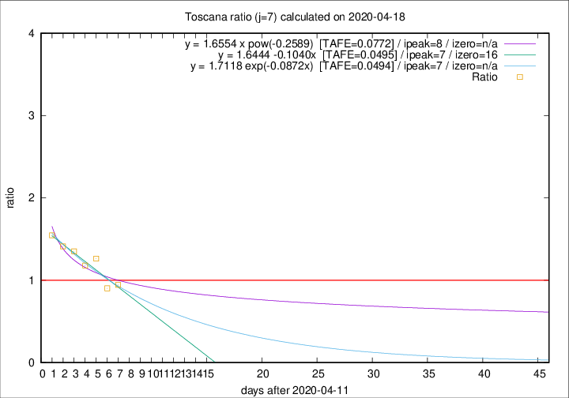

# Toscana

Data source: https://raw.githubusercontent.com/pcm-dpc/COVID-19/master/dati-json/dpc-covid19-ita-regioni.json

Delta days analysis (j): 7

Analyses for other values of j for 2020-04-18 are avalable [here](../2020-04-18/README.md)

Analyses for Toscana for previous dates are avalable [here](../README.md)

## Fitting 
|fit type|best fit equation|tafe|tfe|ipeak|izero|
|-------|-----|--------|------|---|---|
|linear|y = 1.6444 -0.1040x  [TAFE=0.0495]|0.0495|0.0046|7|16|
|exp|y = 1.7118 exp(-0.0872x)  [TAFE=0.0494]|0.0494|0.0024|7|n/a|
|pow|y = 1.6554 x pow(-0.2589)  [TAFE=0.0772]|0.0772|0.0041|8|n/a|

## Data
|Date|Daily deaths|Cumulated deaths|Deaths in the last 7 days|Deaths in the 7 days before|ratio|
|----|----------|-----------|-------|--------------------|-----|
|2020-04-18|16|618|151|160|0.9437|
|2020-04-17|17|602|148|164|0.9024|
|2020-04-16|29|585|177|140|1.2643|
|2020-04-15|18|556|164|139|1.1799|
|2020-04-14|20|538|169|125|1.3520|
|2020-04-13|23|518|168|119|1.4118|
|2020-04-12|28|495|170|110|1.5455|

[Download data as CSV](COVID-19_toscana_j7_2020-04-18.csv)

Generated April 19th, 2020 at 18:42:39 UTC+0200 with https://github.com/robianc/COVID-19
