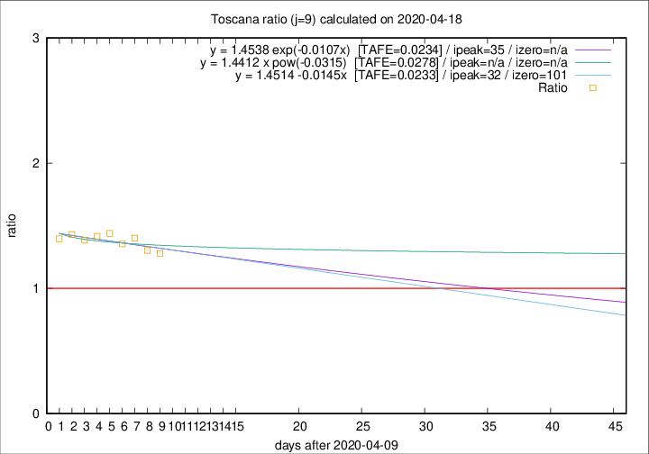

# Toscana

Data source: https://raw.githubusercontent.com/pcm-dpc/COVID-19/master/dati-json/dpc-covid19-ita-regioni.json

Estimates in this page were made on 19/4/2020 with data available until 18/04/2020.

## Summary 

### Peak estimate 
|j|linear [TAFE]|exponential [TAFE]|power law [TAFE]|details|
|---|----|-----------|---------|-------|
|7|19/4/2020 [TAFE=0.0495]|19/4/2020 [TAFE=0.0494]|20/4/2020 [TAFE=0.0772]|[analysis](COVID-19_toscana_j7_2020-04-18.md)|
|8|21/4/2020 [TAFE=0.0867]|21/4/2020 [TAFE=0.0943]|10/5/2020 [TAFE=0.1112]|[analysis](COVID-19_toscana_j8_2020-04-18.md)|
|9|12/5/2020 [TAFE=0.0233]|15/5/2020 [TAFE=0.0234]|-|[analysis](COVID-19_toscana_j9_2020-04-18.md)|
|10|-|-|-|[analysis](COVID-19_toscana_j10_2020-04-18.md)|
|11|-|-|-|[analysis](COVID-19_toscana_j11_2020-04-18.md)|
|12|-|-|-|[analysis](COVID-19_toscana_j12_2020-04-18.md)|
|13|29/4/2020 [TAFE=0.0736]|3/5/2020 [TAFE=0.0713]|16/7/2020 [TAFE=0.0540]|[analysis](COVID-19_toscana_j13_2020-04-18.md)|
|14|20/4/2020 [TAFE=0.1036]|22/4/2020 [TAFE=0.0835]|5/5/2020 [TAFE=0.0361]|[analysis](COVID-19_toscana_j14_2020-04-18.md)|

Best estimator is linear with j=9 (TAFE=0.0233)
Corresponding peak date estimate is 12/5/2020 (ipeak 32)

Peak date range estimate: 10/4/2020 - 20/7/2020

### End estimate 
|j|linear [TAFE/TFE]|exponential [TAFE/TFE]|power law [TAFE/TFE]|details|
|---|----|-----------|---------|-------|
|7|28/4/2020 [TAFE=0.0495]|-|-|[analysis](COVID-19_toscana_j7_2020-04-18.md)|
|8|-|-|-|[analysis](COVID-19_toscana_j8_2020-04-18.md)|
|9|20/7/2020 [TAFE=0.0233]|-|-|[analysis](COVID-19_toscana_j9_2020-04-18.md)|
|10|-|-|-|[analysis](COVID-19_toscana_j10_2020-04-18.md)|
|11|-|-|-|[analysis](COVID-19_toscana_j11_2020-04-18.md)|
|12|-|-|-|[analysis](COVID-19_toscana_j12_2020-04-18.md)|
|13|-|-|-|[analysis](COVID-19_toscana_j13_2020-04-18.md)|
|14|-|-|-|[analysis](COVID-19_toscana_j14_2020-04-18.md)|

Best estimator is linear with j=9 (TAFE=0.0233)
Corresponding end date estimate is 20/7/2020 (izero 101)

End date range estimate: 10/4/2020 - 20/7/2020

Generated April 19th, 2020 at 18:42:39 UTC+0200 with https://github.com/robianc/COVID-19
