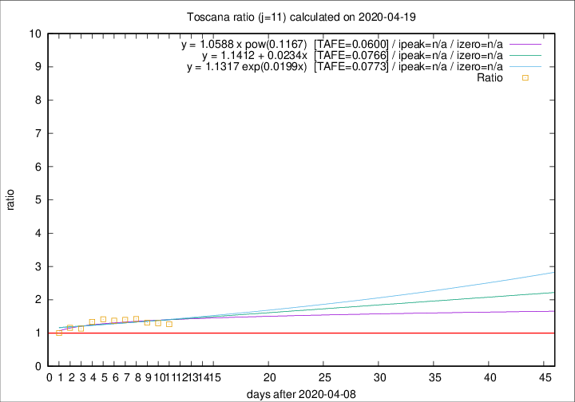

# Toscana

Data source: https://raw.githubusercontent.com/pcm-dpc/COVID-19/master/dati-json/dpc-covid19-ita-regioni.json

Delta days analysis (j): 11

Analyses for other values of j for 2020-04-19 are avalable [here](../2020-04-19/README.md)

Analyses for Toscana for previous dates are avalable [here](../README.md)

## Fitting 
|fit type|best fit equation|tafe|tfe|ipeak|izero|
|-------|-----|--------|------|---|---|
|linear|y = 1.1412 + 0.0234x  [TAFE=0.0766]|0.0766|0.0071|n/a|n/a|
|exp|y = 1.1317 exp(0.0199x)  [TAFE=0.0773]|0.0773|0.0039|n/a|n/a|
|pow|y = 1.0588 x pow(0.1167)  [TAFE=0.0600]|0.0600|0.0021|n/a|n/a|

## Data
|Date|Daily deaths|Cumulated deaths|Deaths in the last 11 days|Deaths in the 11 days before|ratio|
|----|----------|-----------|-------|--------------------|-----|
|2020-04-19|19|637|245|194|1.2629|
|2020-04-18|16|618|249|192|1.2969|
|2020-04-17|17|602|252|192|1.3125|
|2020-04-16|29|585|260|183|1.4208|
|2020-04-15|18|556|249|178|1.3989|
|2020-04-14|20|538|248|181|1.3702|
|2020-04-13|23|518|250|177|1.4124|
|2020-04-12|28|495|242|181|1.3370|
|2020-04-11|13|467|223|197|1.1320|
|2020-04-10|46|454|223|193|1.1554|
|2020-04-09|16|408|193|193|1.0000|

[Download data as CSV](COVID-19_toscana_j11_2020-04-19.csv)

Generated April 19th, 2020 at 18:42:39 UTC+0200 with https://github.com/robianc/COVID-19
